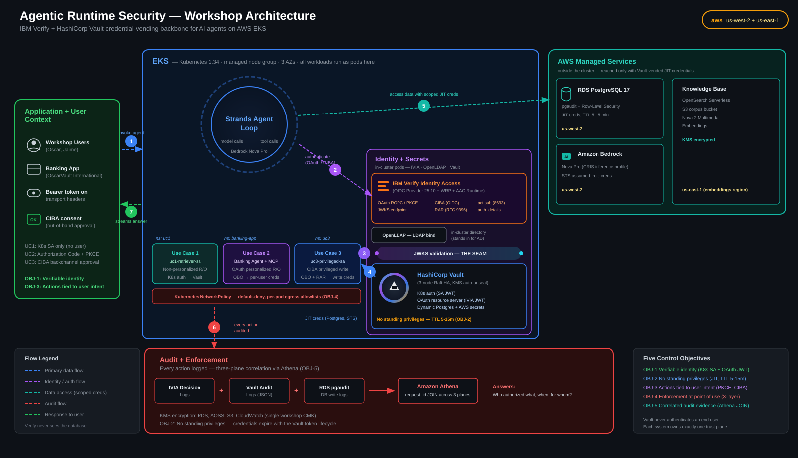

# Agentic Runtime Security on AWS

Step-by-step **hands-on** AWS Workshop Studio workshop that deploys the IBM Verify + HashiCorp Vault reference architecture for runtime AI agent security on EKS. Attendees follow guided modules to provision and verify three progressively-layered use cases on a single `us-west-2` cluster: workload identity (UC1), OAuth user identity (UC2), CIBA mobile-push approval for privileged writes (UC3).

**Duration:** ~2 hours minimum end-to-end (longer if attendees pause to inspect Vault policies, IVIA decisions, or the Athena audit correlation between modules).

**Audience:** workshop admins running this for their orgs. Attendee-facing pages live in `workshop/content/`.

**Latest release:** [v0.15.0](https://github.ibm.com/Oscar-Medina/agentic-runtime-security-aws/releases/latest) — UC1/UC2/UC3 all green end-to-end.



---

## Quick start (admin)

```bash
# 1. Preview the workshop content locally before deploying anything
bash workshop/scripts/preview.sh

# 2. Verify your CLI tools + AWS account + Bedrock access
bash infrastructure/scripts/check-prerequisites.sh

# 3. Deploy the full stack and run all use-case verifications
bash infrastructure/scripts/workshop-e2e.sh --interactive --skip-teardown

# 4. Spot-check each use case (run individually as needed)
bash infrastructure/scripts/verify-uc1.sh
bash infrastructure/scripts/verify-uc2.sh
bash infrastructure/scripts/verify-uc3.sh
bash infrastructure/scripts/verify-uc3.sh --bypass    # negative tests (forged JWT, missing may_act)

# 5. Tear down everything (no orphans)
bash infrastructure/scripts/teardown.sh
```

All scripts are idempotent. `workshop-e2e.sh --help` lists every flag (`--start-from`, `--dry-run`, `--teardown-only`, `--nuke`, etc.).

---

## Required licenses (must obtain before deploy)

IVIA does not deploy without two artifacts from IBM:

1. **IBM Container Registry entitlement key** — lets the cluster pull `icr.io/ibm-vassd/verify-access:11.0.2` images. From IBM Cloud → Container Software Library.
2. **IVIA 90-day trial activation certificate** — unlocks the IVIA server at runtime.

Both go into `infrastructure/terraform.tfvars`. Full procurement steps: [`workshop/content/20-prerequisites/22-ivia-licensing/`](workshop/content/20-prerequisites/22-ivia-licensing/index.en.md).

Bedrock access required: enable `us.amazon.nova-pro-v1:0` (Nova Pro via CRIS) in `us-west-2` and `amazon.nova-2-multimodal-embeddings-v1:0` in `us-east-1` for the Knowledge Base.

---

## Workshop content (preview + publish)

Attendee-facing pages live under `workshop/content/` (Hugo + AWS Workshop Studio v2 contentspec). Three admin actions:

```bash
# Preview locally — auto-downloads the AWS Workshop Studio preview CLI on first run,
# caches it at workshop/tmp/preview_build, then serves http://localhost:8080.
# Open that URL in a browser to read the workshop exactly as attendees will.
bash workshop/scripts/preview.sh

# Sync diagram SVGs from assets/ into workshop/static/images/ (run before publish).
bash workshop/scripts/package-assets.sh

# Publish to AWS Workshop Studio with an explicit version tag.
bash workshop/scripts/publish.sh <version>    # e.g. 0.15.0
```

Edit content under `workshop/content/<NN-section>/index.en.md` (or `<NN-section>/<NN-subpage>/index.en.md`). The preview reloads on file change — keep it running in a side terminal while editing.

---

## Admin-only test + diagnostic scripts

The workshop content never shows attendees these. Use them to isolate problems, sanity-check a fresh deploy, or re-run a single layer after a change. All live under `infrastructure/scripts/`.

| Script | When to run | What it checks |
|---|---|---|
| `workshop-e2e.sh` | Full clean deploy + validate | Phases 0–8: prerequisites → bootstrap → `terraform apply` → kubectl config → foundation tests → IVIA → Vault init/config → UC1/UC2/UC3 → optional teardown. `--start-from <phase>` resumes; `--dry-run` previews. |
| `e2e-validate.sh` | After any layer change | Runs every `verify-*.sh` + `test-*.sh` end-to-end and emits one summary. Use this to confirm nothing regressed before opening a PR. |
| `test-foundation.sh` | After `terraform apply` | EKS + RDS + Bedrock KB + OpenLDAP all healthy. |
| `test-eks.sh` | If pods won't schedule | Cluster nodes Ready, addons running, IAM/IRSA wired. |
| `test-rds.sh` | If DB connections fail | Instance status, parameter group, pgaudit + RLS enabled. |
| `test-bedrock-kb.sh` | If UC1 `/query` is empty | KB exists, AOSS collection ready, S3 corpus has objects, ingestion job succeeded. Pair with `sync-bedrock-kb.sh` to re-ingest. |
| `test-vault-verify.sh` | After Vault unseal / re-init | Vault auth methods + secrets engines + policies present. |
| `verify-uc1.sh` / `verify-uc2.sh` / `verify-uc3.sh` | Per use case | See the table below. |
| `verify-uc3.sh --bypass` | Adversarial check | Forged HS256 JWT and a real IVIA token without `may_act` are both rejected by Vault — proves bound_claims actually gate access. |
| `show-audit-correlation.sh` | After a UC3 refund | Runs the three-plane Athena correlation query for a given `request_id` and prints the single forensic row. |
| `sync-bedrock-kb.sh` | After corpus changes | Re-ingests the KB so retrieval matches the current corpus. |

Every `verify-*.sh` and `test-*.sh` script is non-destructive, prints `✓ PASS / ✗ FAIL / ⚠ WARN` markers, and exits non-zero on any FAIL so you can chain them in CI.

---

## What gets deployed

Single-region (`us-west-2`) EKS 1.34 cluster running:

- **HashiCorp Vault** (Raft 3-node, KMS auto-unseal) — non-human IAM, JIT credentials.
- **IBM Verify Identity Access 11.0.2** — 7 pods: `iviaconfig` (LMI), `iviaruntime` (AAC), `iviadsc` (DSC), `iviawrprp1` (WebSEAL reverse proxy), `iviaop` (OIDC Provider), `openldap`, `postgresql`. Owns human IAM, OAuth, CIBA.
- **UC1/UC2/UC3 Strands agents** plus the banking-app UI for UC2/UC3.
- **RDS PostgreSQL** with Row-Level Security + pgaudit.
- **Bedrock Knowledge Base** (AOSS + Nova 2 Multimodal Embeddings, us-east-1) and Nova Pro inference (us-west-2 via CRIS).
- **Three-plane audit pipeline** — fluent-bit → Firehose → S3 → Glue → Athena workgroup `workshop`.

State lives locally in `infrastructure/terraform.tfstate`. No HCP, no Terraform Stacks.

---

## Use cases (admin TL;DR)

| | What it proves | TTL | Verify |
|---|---|---|---|
| **UC1** — Non-personalized read-only | Vault Kubernetes auth → JIT Postgres + Bedrock STS. No standing creds. | 15m | `verify-uc1.sh` (9 checks) |
| **UC2** — OAuth personalized read-only | Authorization Code + PKCE via IVIA → per-user JIT creds → Postgres RLS. ENFC-02 (no INSERT) + ENFC-03 (NetworkPolicy egress block). | 15m | `verify-uc2.sh` (14 checks) |
| **UC3** — CIBA privileged write | Mobile-push approval via **IBM Verify app** on the admin's phone → RFC 8693 token exchange with `may_act` + RFC 9396 RAR `authorization_details` enforced by Vault `bound_claims` → three-plane Athena audit correlation by `request_id`. | 5m | `verify-uc3.sh` (15 checks) + `--bypass` (2 negative tests) |

UC3 requires the free **IBM Verify** app installed on a phone (App Store / Google Play) **before** running the refund flow — used for the mobile-push approval. Enrollment URL is printed by `terraform -chdir=infrastructure output -raw wrp_public_fqdn` plus the path documented at `workshop/content/70-use-case-3/70-enroll-device/`.

---

## Repo map

- `infrastructure/` — Terraform IaC + admin scripts (`workshop-e2e.sh`, `teardown.sh`, `check-prerequisites.sh`, `verify-uc*.sh`, build/seed/config scripts).
- `infrastructure/modules/` — one module per layer; **each module has its own `README.md`** (e.g. `verify_access/README.md` documents the IVIA stack + TLS cert ownership; `vault_config/README.md` documents Vault policies/roles).
- `infrastructure/vault-config/` — separate Terraform root run over a `kubectl port-forward` (Vault provider needs cluster-internal access).
- `workshop/content/` — attendee-facing markdown (Hugo + Workshop Studio v2). Preview via `workshop/scripts/preview.sh`.
- `applications/` — `banking-app/` (UI + agent + MCP server for UC2/UC3) and `uc3-agent/` source.
- `assets/` — SVG architecture diagrams + workshop branding.
- `docs/` — admin-facing runbooks (e.g. `docs/IVIA_Deployment.md` for IVIA destroy/rebuild procedure).
- `slides.md` lives in a sibling worktree: `../agentic-runtime-security-aws-slides/` (not in this repo).

---

## Issues + feedback

File issues at <https://github.ibm.com/Oscar-Medina/agentic-runtime-security-aws/issues>. Workshop-tester role guide: [`TESTING.md`](TESTING.md).

## License

MIT-0 (AWS Workshop Studio convention).
