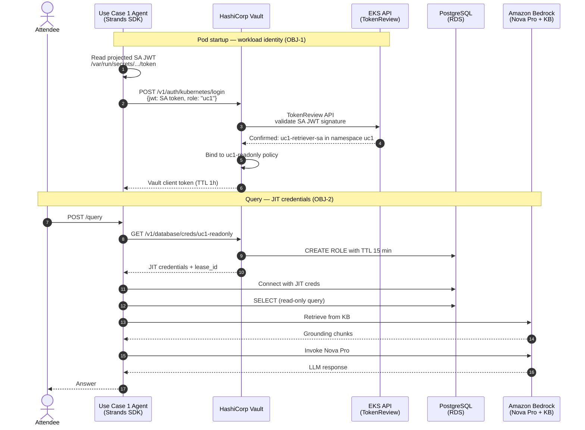

Use Case 1 is a Strands agent that authenticates to Vault using its own
Kubernetes ServiceAccount (`uc1-retriever-sa`), receives just-in-time
credentials, and queries both Amazon RDS (Postgres) and a Bedrock Knowledge
Base. **No user identity is involved** — this is pure workload identity.

The agent pod never holds a long-lived database password or an AWS IAM
credential. Every time it handles a query, it presents its ServiceAccount JWT
to Vault, receives a time-boxed Postgres credential (TTL 15 min) and a scoped
Bedrock STS credential, answers the question, and lets those credentials
expire automatically.

## Objectives covered

| Objective                                          | ID    | How Use Case 1 demonstrates it |
| -------------------------------------------------- | ----- | ------------------------------ |
| Every agent has a verifiable identity              | OBJ-1 | Vault's Kubernetes auth method validates the pod's ServiceAccount JWT against the EKS OIDC provider — only `uc1-retriever-sa` in the `uc1` namespace can obtain the `uc1-readonly` Vault token |
| No standing privileges — JIT credentials only      | OBJ-2 | Postgres credentials are issued with a 15-minute TTL; Bedrock access is a scoped STS session from Vault; neither credential exists on disk or in env at rest |
| Audit trail ties credential issuance to identity   | OBJ-5 | Every Vault dynamic credential issuance event is written to the Vault audit log with the SA-bound principal |

## Request flow

## What you will inspect in the next challenges

1. The Vault policy + Kubernetes auth role that scope `uc1-retriever-sa`.
2. JIT credential issuance via the `uc1-readonly` database role.
3. The Vault audit log entry that ties the credential issuance back to the
   agent's ServiceAccount identity.

No commands to run here — when ready, advance to the next challenge.
