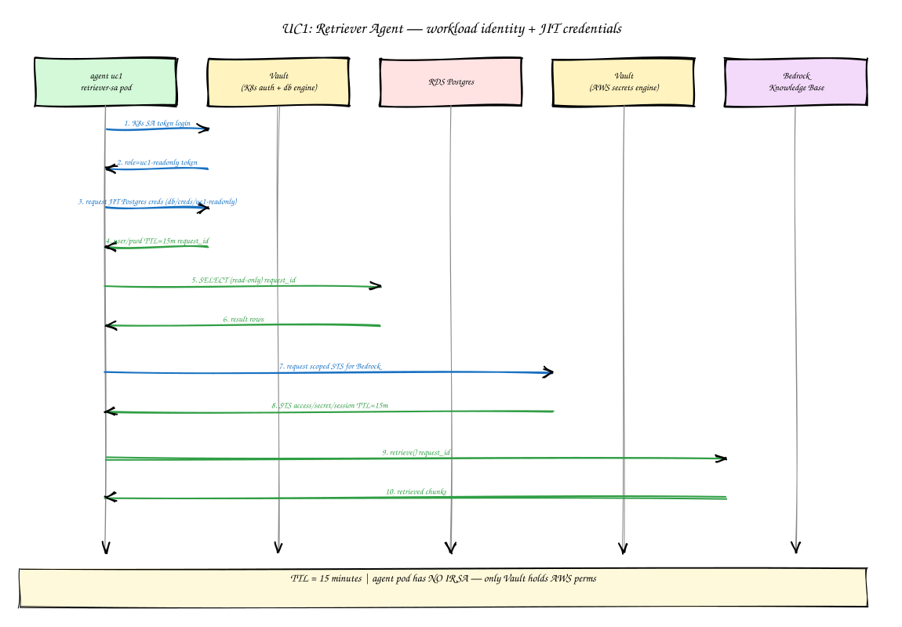
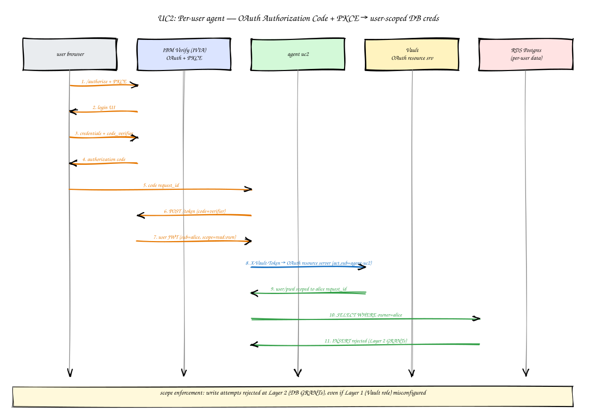
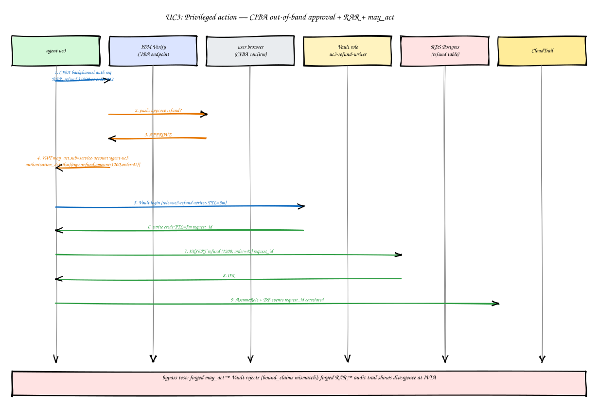

# Agentic Runtime Security on AWS

## A Hands-On Workshop

### IBM Verify Identity Access + HashiCorp Vault on EKS

  
  

**Presenter:** _<presenter name placeholder>_

Note:
Welcome. Over the next ~3 hours we are going to deploy and exercise a real implementation of agentic runtime security on AWS — every agent has a verifiable identity, no standing privileges, every action is tied to user intent, enforcement happens at the point of use, and audit evidence correlates across three trust planes. Three progressively harder use cases (UC1 → UC2 → UC3) build on each other. By the end you will be able to explain — not just demo — why each of the 5 control objectives matters, and what would have failed if we removed the corresponding control. The reference stack is IBM Verify Identity Access + HashiCorp Vault on Amazon EKS.

---

## Agenda

| Phase | Activity | Time |
|-------|----------|------|
| 1 | Scaffold and Pre-Flight (you ran this before arriving) | ~15 min |
| 2 | Foundation Infrastructure (VPC, EKS, RDS, Bedrock KB) | ~30 min |
| 3 | Platform and Configuration (Vault + IBM Verify Access) | ~30 min |
| 4 | Use Case 1 — Non-personalized Read-Only | ~25 min |
| 5 | Use Case 2 — OAuth Personalized Read-Only | ~30 min |
| 6 | Use Case 3 — CIBA Privileged + Audit Correlation | ~40 min |
| 7 | Cleanup, Summary, Appendices | ~10 min |
| | **Total** | **~3 hours** |

Note:
The schedule is aggressive but achievable. Phase 1 is already done — you ran `install-prereqs.sh` and the four pre-flight checks before today. We will spend the most time in Phases 4-6 because that is where the control objectives actually get exercised. Phase 6 is the workshop's pedagogical money shot — a single Athena query joining three trust planes that answers "which user authorized this action, when, against what system, and was access revoked?"

---

## The Problem

- Agentic systems break least-privilege assumptions
- Standing credentials and bearer tokens scale poorly
- "Agent acts on behalf of user" — but **who** authorized **what**, and **when**?
- Auditors ask: across IdP, secrets broker, and AWS, can you join the evidence?

We need: **verifiable identity + brokered credentials + correlated audit**

Note:
Traditional service-to-service patterns assume a small number of long-lived service accounts with broad standing privileges. Agentic AI breaks that — agents act on behalf of arbitrary end users, often with elevated authority for short windows, sometimes with out-of-band human approval. If you ship that on bearer tokens and standing IAM roles you have built a confused-deputy generator. The workshop's thesis: solve it with verifiable workload identity, broker every credential just-in-time, tie privileged actions to explicit user intent (CIBA + RAR + may_act), and propagate a correlation ID across all three planes so auditors can actually answer the question.

---

## 5 Control Objectives — Overview

1. **OBJ-1 — Verifiable identity** for every workload (no shared secrets)
2. **OBJ-2 — No standing privileges** (credentials are JIT, leased, revocable)
3. **OBJ-3 — Actions tied to user intent** (user JWT → scoped credentials)
4. **OBJ-4 — Enforcement at the point of use** (policy + DB + network)
5. **OBJ-5 — Correlated audit evidence** (one `request_id`, three trust planes)

Note:
These five sentences are the workshop. Every other slide either deepens one of them or shows them working together. Memorize the numbering — when we hit Phase 6 you will see all five demonstrated by a single Athena query. The numbering is not arbitrary: each objective layers on top of the previous. You cannot enforce OBJ-3 without OBJ-1 (verifiable identity is a prerequisite for tying actions to user intent), and you cannot deliver OBJ-5 without OBJ-4 (without enforcement at the point of use the audit log only records aspirations, not facts).

---

## OBJ-1 Deep-Dive — Verifiable Identity

**Concrete example (UC1):**

- EKS ServiceAccount `uc1-retriever-sa` projects a Kubernetes service-account JWT
- Vault Kubernetes auth method validates the JWT against the EKS OIDC provider
- Vault role binding `uc1-readonly` matches `(namespace=uc1, sa=uc1-retriever-sa)` → returns a Vault token
- No shared secrets, no static API keys on the agent pod

Note:
Note the deliberate choice — Vault's Kubernetes auth method, **not** IAM Roles for Service Accounts (IRSA). Why? IRSA gives the pod AWS credentials directly; we want every credential to flow through Vault so the audit story is single-pane. The tradeoff is that we depend on Vault availability for cred issuance — which is exactly why Vault Raft is 3-node with KMS auto-unseal. The pedagogical point: identity is verifiable because the SA JWT is signed by the EKS OIDC provider; no human plants a secret on the pod.

---

## OBJ-2 Deep-Dive — No Standing Privileges

**Concrete example (UC1):**

- Vault Postgres database secrets engine, role `uc1-readonly`, **default TTL 15 minutes**
- `creation_statements`: `CREATE ROLE "{{name}}" WITH LOGIN PASSWORD '{{password}}' VALID UNTIL '{{expiration}}'; GRANT readonly TO "{{name}}";`
- `revocation_statements`: `REVOKE ALL ... ; DROP ROLE "{{name}}";`
- Lease revocation event lands in Vault audit log with the `request_id`

Note:
Standing credentials are the original sin of cloud security. Here every Postgres credential is dynamic — Vault calls `CREATE ROLE` at issuance and `DROP ROLE` at revocation. The 15-minute TTL is short enough that even an exfiltrated credential expires before an attacker can use it. Watch for the matching `revocation_statements` — auditors will ask "are you sure these accounts are actually deleted?" and you will be able to grep the Vault audit log to prove it. Same pattern applies to AWS via Vault's AWS secrets engine, which we use for scoped Bedrock STS credentials.

---

## OBJ-3 Deep-Dive — Actions Tied to User Intent

**Concrete example (UC2):**

- User completes OAuth Authorization Code + PKCE against IBM Verify Access
- IVIA issues a user JWT with `aud=agent-uc2`
- Vault `jwt` auth method validates the JWT against IVIA's OIDC discovery URL
- Role `uc2-personal-readonly` enforces `bound_audiences=["agent-uc2"]` and binds the user's `sub` into per-user-scoped DB credentials

Note:
This is where agentic security stops looking like service-to-service security. The agent is no longer running on its own authority — it is running on **the user's** authority, with a JWT that proves the user authorized this action right now. PKCE prevents code-interception in the browser. `bound_audiences` prevents one user's JWT from being replayed at a different agent. The DB credentials Vault returns are scoped per-user (the SQL `creation_statements` plant the user's `sub` into a row-level security predicate). Result: even if UC2 leaked a credential, the blast radius is one user's data, not the dataset.

---

## OBJ-4 Deep-Dive — Enforcement at the Point of Use

**Three layers, three resources:**

| Layer | Where | What |
|-------|-------|------|
| 1 — Policy | Vault | Each SA → exactly one role; cross-role token rejected |
| 2 — Resource | RDS / IAM | DB GRANTs + scoped Bedrock STS reject out-of-scope ops |
| 3 — Network | EKS | NetworkPolicy denies egress to non-approved endpoints |

Layer 4 (Envoy/OPA per-call) → **Appendix**

Note:
Defense in depth is a cliché until you actually wire it. We enforce in three places, on purpose: Vault rejects an SA asking for a role it does not own (Layer 1); the database itself rejects an INSERT on a R/O credential (Layer 2); the pod cannot exfiltrate through a side channel because NetworkPolicy whitelists kube-dns + RDS + Vault + IVIA (WRP + OIDC Provider) + Bedrock endpoints only (Layer 3). UC2 demonstrates Layer 2 by attempting an INSERT and watching it fail at Postgres, **not** at the agent. Layer 4 — Envoy + OPA per-API-call enforcement — is in the appendix because it is heavy-weight; the three layers above are the workshop minimum.

---

## OBJ-5 Deep-Dive — Correlated Audit Evidence

- One `request_id`, propagated end-to-end
- IVIA decision log + Vault audit log + AWS CloudTrail
- Single Athena query JOINs all three by `request_id`

Note:
This slide is the workshop's pedagogical money shot. The diagram has two halves on purpose — top half is the temporal story (User → WRP (authentication) → IVIA OIDC Provider (consent + token) → agent → Vault → RDS → CloudTrail), bottom half is the JOIN visualization (three log stores, one query). Auditors will ask "which user authorized this privileged action against this resource at this time, and was access revoked?" — and the only answer that survives scrutiny is the one where you can produce a single query that proves it. We will run that query at the end of Phase 6. The design tax — propagating `request_id` everywhere — is paid in Phase 1, exercised in Phase 6.

---

# The IBM Verify + HashiCorp Vault Answer

### How responsibility splits between identity and secrets

Note:
Section break. The next slide is the diagram you should keep open in a second window for the rest of the workshop — it answers the question "which system does what?" cleanly. IBM Verify Identity Access owns user identity, OAuth flows, CIBA, RAR, and JWT signing. HashiCorp Vault owns workload identity (Kubernetes auth), JWT validation against IVIA, dynamic secrets engines (Postgres + AWS), and the audit device that drops every credential issuance into CloudWatch. The split is deliberate — they are best-of-breed at different problems and they meet at the JWT.

---

## Verify+Vault Responsibility Split (SKO Slide 13 redraw)

Note:
This is a workshop-native redraw of SKO 2026 Slide 13. IBM Verify Identity Access owns the **user-identity plane** — it runs the OAuth Authorization Code + PKCE flow for Use Case 2, the CIBA out-of-band approval flow for Use Case 3, the RAR (RFC 9396) authorization-details enforcement, and the JWT signing key. The **Web Reverse Proxy (WRP)** is IVIA's browser-facing entry point — it handles user authentication against Simple AD and serves the CIBA consent page via junction. The standalone OIDC Provider only issues tokens; WRP provides the authentication engine that fronts every browser-initiated flow. HashiCorp Vault owns the **workload-identity and secrets plane** — it runs the Kubernetes auth method (validates EKS SA JWTs), the `jwt` auth method (validates IVIA-issued user JWTs), the Postgres database secrets engine (dynamic R/O and R/W roles), the AWS secrets engine (scoped Bedrock STS), and the audit device. They meet at the user JWT — IVIA mints it, Vault validates it. Neither system has to know the other's internals; they share an OIDC discovery URL and an audience claim.

---

# Three Use Cases — Preview

### UC1 → UC2 → UC3 strictly layer (each is a superset of the previous)

Note:
Section break. UC1 is the foundational pattern — workload identity + JIT credentials + audit. UC2 adds OAuth personalization on top of UC1. UC3 adds CIBA out-of-band approval, may_act delegation, and RAR enforcement on top of UC2 — and exercises the audit-correlation diagram end-to-end. They are intentionally not reorderable; each one fails to deliver the next objective without the previous one in place. Watch the SVGs as we preview them — same color coding (workload identity = blue, user identity = purple, data plane = orange) appears across all three.

---

## UC1 — Non-personalized Read-Only

**Pattern:** agent SA → Vault K8s auth → JIT R/O Postgres + scoped Bedrock STS

**Objectives demonstrated:** OBJ-1, OBJ-2, OBJ-5

Note:
UC1 is the simplest case — an internal retrieval agent that has no notion of "user" at all. It runs on its own ServiceAccount `uc1-retriever-sa`, authenticates to Vault via the Kubernetes auth method, and receives a 15-minute R/O Postgres credential plus a scoped Bedrock STS credential for hitting the Knowledge Base. There is no JWT in the picture yet — that comes in UC2. The point of UC1 is to nail the foundational pattern: even a non-personalized agent gets verifiable identity, JIT credentials, and an audit trail. If you cannot do UC1 cleanly, none of the harder cases will work.

---

## UC2 — OAuth Personalized Read-Only

**Pattern:** user OAuth + PKCE → user JWT → Vault `jwt` auth → per-user scoped credentials

**Objectives demonstrated:** OBJ-1, OBJ-2, OBJ-3 (added), OBJ-4 (Layer 2 + 3), OBJ-5

Note:
Use Case 2 introduces the user. Browser hits IVIA's Web Reverse Proxy (WRP), which authenticates the user against Simple AD and fronts the OAuth Authorization Code + PKCE flow — the OIDC Provider receives an already-authenticated session from WRP and returns a user JWT. The agent presents that JWT to Vault's `jwt` auth method, and Vault issues per-user-scoped Postgres credentials. We will demonstrate Layer 2 enforcement by attempting an INSERT through the R/O credential and watching Postgres reject it — and Layer 3 enforcement by attempting egress to an unapproved endpoint and watching NetworkPolicy block it. End the user session, watch Vault revoke the lease in the audit log. UC2 is where OBJ-3 (actions tied to user intent) actually shows up in the system.

---

## UC3 — CIBA Privileged + Audit Correlation

**Pattern:** CIBA out-of-band approval → JWT with `may_act` (RFC 8693) + `authorization_details` (RFC 9396 RAR) → time-boxed write creds (TTL 5m) → Athena correlation

**Objectives demonstrated:** **all 5**

Note:
Use Case 3 is the workshop's pedagogical money shot — it exercises **all five** control objectives in a single flow. A privileged action triggers an out-of-band CIBA approval — the agent displays a consent URL that routes through the IVIA Web Reverse Proxy (WRP). The user clicks the link, WRP authenticates them against Simple AD, then forwards the authenticated session to the OIDC Provider's consent page. The user approves, IVIA mints a JWT carrying `may_act` (RFC 8693 Token Exchange) and `authorization_details` (RFC 9396 RAR) claims, Vault validates those claims via `bound_claims`, and issues a 5-minute write credential. The agent performs the privileged action against RDS. Then we run the bypass test — forge a `may_act` claim and watch Vault reject it; this proves the controls are real, not theater. Finally, the Athena query joins IVIA decision logs + Vault audit + CloudTrail by `request_id` and answers the auditor's question end-to-end.

---

<!-- .slide: data-state="thankyou" -->

# Thank You

### Q&A

**Workshop URL:** _<workshop URL placeholder>_

**Repo:** _<repo URL placeholder>_

Note:
Wrap-up. Three things to take away: (1) every agent must have a verifiable identity that auditors can trace back to a signing authority, not a shared secret; (2) every credential must be JIT-issued and short-lived, with the revocation path tested, not assumed; (3) audit evidence is only useful if it correlates across trust planes — design the propagation in Phase 1, not Phase 6. Slides, repo, and pre-flight scripts are at the URLs above. Open the floor for Q&A.
