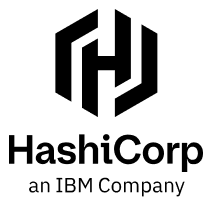
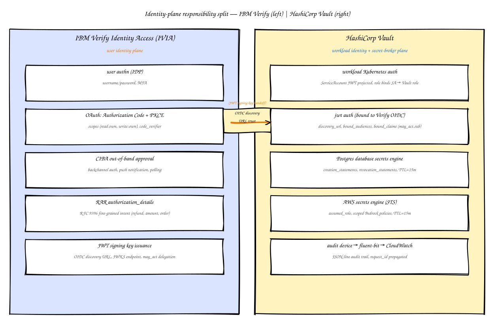
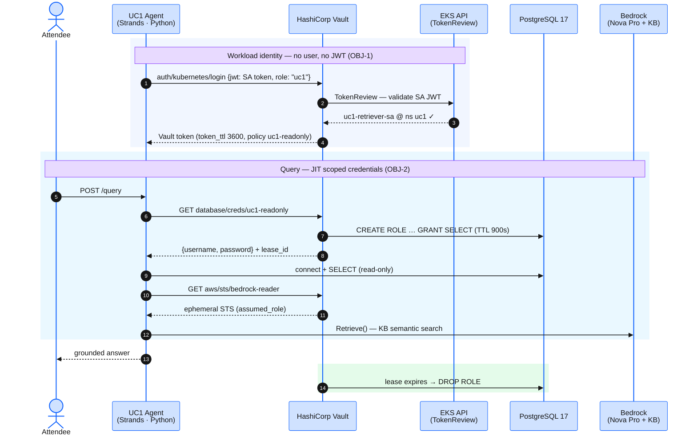
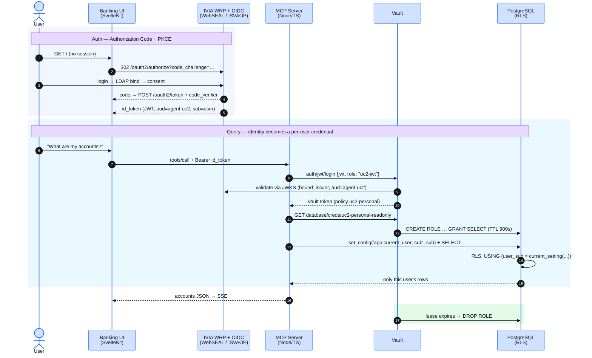
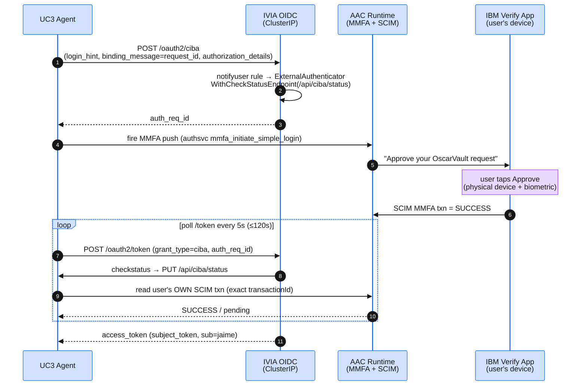
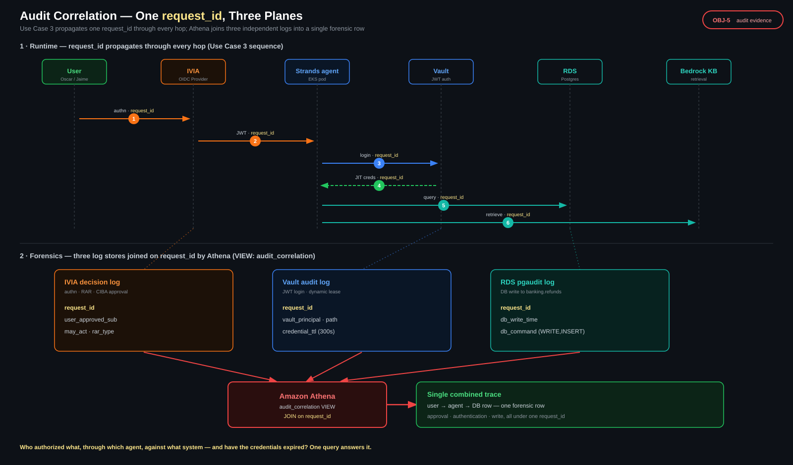

<style>
.reveal section .mermaid { text-align: center; margin: 0 auto; }
.reveal section .mermaid svg { max-height: 560px; max-width: 96%; height: auto; width: auto; }
.reveal section .uc-footer { font-size: 0.5em; color: #555; margin-top: 6px; }
.reveal section pre code { font-size: 0.74em; line-height: 1.25; }
.reveal section table { font-size: 0.62em; }
.reveal section .tight li { margin: 2px 0; }
</style>

# Agentic Runtime Security on AWS


<div style="display:flex; gap:40px; align-items:center; justify-content:center; margin-top:24px;">
  
  
</div>

**Presenter:** _<presenter name placeholder>_

Note:
This is a real, deployable reference implementation, not a concept deck. Thesis in one line: no agent in this system ever holds a standing database grant or a static cloud key — every credential is brokered just-in-time, scoped to the exact action, and expires on a short TTL. IBM Verify Identity Access (IVIA) owns user identity; HashiCorp Vault owns workload identity and credential vending; AWS-native services (EKS, RDS, Bedrock, Athena, KMS) are the runtime and the enforcement-and-audit surface. Three use cases layer strictly: UC1 workload-only, UC2 user-scoped, UC3 privileged + delegated + audited. UC3 is where we'll spend most of our time.

---

## The credential problem agents create

<div class="tight">

- **Agents are neither users nor classic workloads** — sometimes acting autonomously, sometimes on behalf of a user; the boundary moves request to request
- **Standing secrets don't fit** — a long-lived DB user or static IAM key on a pod is blast radius that survives the request that needed it
- **Bearer tokens sprawl** — machine:human identity ratio ~**45:1**; every new agent multiplies the standing-grant inventory
- **Three identity questions, simultaneously** — _who is asking?_ (user) · _which workload is acting?_ (agent) · _what credential touches Postgres / Bedrock?_ (data)

</div>

The hard part is binding all three together for one action — and being able to prove it afterward.

Note:
Legacy IAM answers "who is asking" for humans and "which workload" for deterministic services, but it was never designed for a process that switches between autonomous and delegated within a session. The failure mode isn't exotic: a compromised agent with a standing read/write DB user and a static Bedrock key is a durable foothold. The fix is to stop issuing durable things. The rest of the deck is the mechanics of that.

---

## The invariant: nothing standing, everything brokered

Every credential an agent uses is **minted on demand, scoped to the action, and short-lived**:

| Credential | How it's obtained | TTL |
|---|---|---|
| Vault client token | Proven identity (K8s SA JWT **or** OIDC JWT) | 1h (`token_ttl 3600`) |
| Postgres **read** role | `database/creds/*-readonly` — Vault `CREATE ROLE` per request | **15m** (`900s` / max `1800s`) |
| Postgres **write** role (UC3) | `database/creds/uc3-refund-writer` — gated on delegated JWT | **5m** (`300s` / max `600s`) |
| AWS STS (Bedrock) | `aws/sts/bedrock-reader` — `assumed_role`, vended per call | Ephemeral STS session |

No pod ships with a DB password or a static AWS key. Lease expiry → Vault `DROP ROLE`.

Note:
This table is the whole thesis made concrete, and the numbers are exact from `vault_config`. Reads get 15-minute Postgres roles; the one privileged write path gets 5 minutes and only after a human approves. Bedrock is never reached with a baked-in key — Vault's AWS secrets engine assumes a role and hands back an ephemeral STS session scoped to `bedrock:InvokeModel`/`Retrieve`. Revocation is not a separate system: when the lease ends Vault drops the Postgres role, so a leaked credential is dead in minutes whether or not anyone noticed.

---

## Two brokers, one OIDC seam



**IBM Verify** brokers human identity — OAuth/OIDC, PKCE, CIBA. **HashiCorp Vault** brokers workload identity & credentials — K8s/JWT auth, dynamic DB roles, STS. They meet at exactly **one** seam: Vault's JWT auth trusts IVIA's JWKS via `bound_issuer`.

Note:
Clean separation of duties, usually different teams. Verify never sees a database; Vault never authenticates an end user. The single integration point is OIDC: Vault's JWT auth method is configured with IVIA's `jwks_url` and pins `bound_issuer` to IVIA's issuer, so a user (or delegated) token minted by IVIA becomes the thing that unlocks a Vault-vended, short-lived credential. That seam is where "user intent" crosses into "workload credential" — and it's the only place the two systems touch.

---

## Reference architecture


IVIA + Vault credential-vending backbone on AWS-native services — EKS 1.34 · RDS PostgreSQL 17 · Bedrock · Athena

Note:
Keep this open in a second window. IVIA owns the user-identity plane; Vault owns workload identity and credential vending; AWS-native services are the runtime and the enforcement surface. Everything in the cluster authenticates to Vault — there is no other source of database or cloud credentials.

---

## AWS-native enforcement & audit surface

| Service | Security role |
|---|---|
| **Amazon EKS** (1.34) | Workload runtime; cluster **OIDC provider** anchors SA-based workload identity (TokenReview) |
| **Amazon RDS PostgreSQL 17** | **pgaudit** + **Row-Level Security**; only Vault-vended dynamic roles connect |
| **Amazon Bedrock** | Nova Pro inference (`us.amazon.nova-pro-v1:0`, CRIS) + Nova 2 embeddings; reached via **Vault AWS STS** |
| **OpenSearch Serverless + S3** | Bedrock Knowledge Base vector store + corpus |
| **AWS KMS** | Two regional CMKs: `workshop` (RDS, audit S3, CloudWatch · us-west-2) + `kb` (AOSS, corpus S3 · us-east-1) |
| **Amazon Athena** | Cross-plane audit correlation (`audit_correlation` view) |

Embedding model is **us-east-1 only**; all else **us-west-2**. Enforcement lives in the AWS primitives — Vault brokers, AWS enforces and records.

Note:
The division of labor matters for an expert audience: Verify and Vault decide identity and vend credentials, but the actual enforcement is AWS-native. RDS enforces RLS and writes pgaudit; the EKS OIDC provider is what Vault's Kubernetes auth validates SA tokens against; two regional CMKs encrypt every store — a us-west-2 `workshop` key (RDS, audit S3, CloudWatch) and a us-east-1 `kb` key (AOSS, corpus S3), since KMS keys are regional; Athena answers the auditor's question. Nova Pro is the cross-region inference profile id (`us.` prefix — the bare id is rejected for on-demand throughput); Nova 2 Multimodal Embeddings is us-east-1 only, which is why the KB plane is split into a second region.

---

# Three use cases

### UC1 → UC2 → UC3 — each adds a scoping dimension

workload-only → user-scoped rows → privileged write + delegated identity + audit

Note:
Not reorderable. UC1 proves workload identity with no user in the picture. UC2 adds a real user and scopes data to that user's rows. UC3 adds a privileged action that requires out-of-band human approval, a delegated identity, and a correlated audit trail. The first two are deliberately the "easy" cases — but note they are not unsecured: even the read-only retrieval agent holds zero standing credentials. UC3 is the hero.

---

### UC1 — workload identity, JIT read credentials



<p class="uc-footer">K8s SA → Vault kubernetes auth → SELECT-only Postgres role (900s) + scoped Bedrock STS &nbsp;·&nbsp; OBJ-1, 2, 5</p>

Note:
The simplest pattern — a retrieval agent with no notion of "user." It runs on ServiceAccount `uc1-retriever-sa` in namespace `uc1`, authenticates to Vault's Kubernetes auth method (role `uc1`, which binds exactly that SA + namespace), and Vault validates the SA token via a TokenReview against the EKS OIDC provider. It then gets a 15-minute SELECT-only Postgres role and an ephemeral Bedrock STS session — never a static key. Security takeaway: even the trivial case ships zero standing credentials. If UC1 doesn't hold, nothing harder will.

---

### UC2 — user identity propagation + per-row scoping



<p class="uc-footer">user JWT (PKCE) → Vault jwt auth → SELECT-only role + Postgres RLS on <code>user_sub</code> &nbsp;·&nbsp; + OBJ-3, 4</p>

Note:
The user enters. IVIA runs Authorization Code + PKCE and mints a user id_token (aud `agent-uc2`, `sub` = the user). The MCP server (Node/TypeScript) presents that JWT to Vault's JWT auth role `uc2-jwt`, which validates it against IVIA's JWKS and pins `bound_audiences=["agent-uc2"]`. Vault issues a 15-minute SELECT-only Postgres role; the MCP server calls `set_config('app.current_user_sub', <sub>)` and Postgres RLS policy `user_accounts USING (user_sub = current_setting('app.current_user_sub', true))` filters every row. Note the column is `user_sub`. Two enforcement dimensions get added here, proven on the next slide.

---

### UC2 — enforcement is tested, not asserted

Two negative tests ship in `verify-uc2.sh`:

<div class="tight">

- **ENFC-02 — read-only means read-only.** An `INSERT` on `banking.accounts` using the `uc2-personal-readonly` credential is rejected by Postgres: `permission denied for table accounts`. The grant is `SELECT`-only; there is no application code path to "accidentally" widen it.
- **ENFC-03 — egress is default-deny.** The MCP pod's `NetworkPolicy` allows egress to **only** Vault (8200), RDS (5432), and IVIA (443). A `wget` to any external host (`httpbin.org`) is `BLOCKED`.

</div>

A control you haven't tried to bypass is a control you haven't verified.

Note:
This is the slide that earns credibility with a security audience. We don't claim least privilege — we attempt the privilege and show the rejection. ENFC-02 proves the database itself enforces the read-only boundary, independent of agent code. ENFC-03 proves the agent can't exfiltrate or call out to an unapproved endpoint even if compromised, because the Kubernetes NetworkPolicy is an allowlist of three destinations. Both are real `kubectl`-driven checks in the verify script, not stubs.

---

# Use Case 3 — the hero

### Privileged write = human approval + delegated identity + bound, 5-minute credential

Three standards composed: **OIDC CIBA** · **RFC 8693** token exchange · **RFC 9396** RAR

Note:
UC3 is a privileged action — issuing a refund that writes to the database. Everything tightens: the human must approve out-of-band on a physical device; the agent's identity must be cryptographically delegated, not assumed; and the write credential is gated on claims that only a genuine delegation can carry, then expires in five minutes. Three OAuth/OIDC standards do the work, and Vault is the point-of-use gate. We'll walk the flow, the token, the Vault gate, and the bypass test that proves the gate is real.

---

### UC3 — CIBA out-of-band approval (mobile push)



<p class="uc-footer">backchannel CIBA · machine-to-machine · approval is a physical tap, matched to the exact MMFA transaction</p>

Note:
This is the deployed reality — mobile push, not a browser consent page. The agent POSTs `/oauth2/ciba` directly to the OIDC Provider ClusterIP (bypasses the WRP — it's machine-to-machine) with `login_hint` = the authenticated user, `binding_message` = the request_id audit anchor, and the refund `authorization_details`. IVIA's `notifyuser` rule wires completion to a server-polled check-status endpoint on the agent. The agent fires the MMFA push to the user's enrolled IBM Verify device. Unforgeable because two independent facts must hold: the user physically taps Approve, AND the agent confirms the exact MMFA transaction it fired — matched by `transactionId`, never "any SUCCESS for the user" — resolved to SUCCESS in that user's own SCIM record. Identity comes from the authenticated session, never an LLM parameter.

---

### UC3 — delegation: RFC 8693 token exchange

The CIBA token proves the user approved. It does **not** prove which agent is acting. Token exchange produces a delegated JWT that carries both.

```text
POST /oauth2/token
  grant_type    = urn:ietf:params:oauth:grant-type:token-exchange
  subject_token = <CIBA user access_token>          # proves user + consent
  (client auth  = uc3-actor, HTTP Basic)            # NO actor_token sent — IVIA
                                                    # rejects self-exchange (FBTAQ5207E)
```

IVIA's `isvaop_pretoken` mapping rule stamps the delegated JWT **server-side**:

```jsonc
{
  "sub": "jaime",                                   // the human who approved
  "may_act": { "sub": "uc3-actor" },                // RFC 8693 — WHO may act
  "authorization_details": [{ "type": "refund_approval" }]  // RFC 9396 — WHAT class
}
```

<p class="uc-footer">delegation + RAR type are injected by IVIA, not asserted by the agent — the agent cannot forge its own authority</p>

Note:
The key technical point an expert will probe: the agent does not send an `actor_token` and does not set its own `may_act`. It authenticates the exchange as a separate OAuth client (`uc3-actor`) and presents only the user's subject_token; IVIA refuses a client exchanging its own token (FBTAQ5207E). The `may_act` and `authorization_details` claims are injected by the `isvaop_pretoken` mapping rule on the token-exchange grant. So the proof of "who may act" is minted by the identity provider, not claimed by the workload — which is exactly what makes it trustworthy at the Vault gate.

---

### UC3 — the Vault gate (OBJ-4 point of use)

Vault JWT role `uc3-jwt` issues **nothing** unless the delegated JWT satisfies all of:

```hcl
bound_issuer    = <IVIA issuer>          # RS256, validated via IVIA JWKS
bound_audiences = ["uc3-actor"]          # RFC 8693: audience = the actor that exchanged
bound_claims_type = "glob"
bound_claims = {
  "/may_act/sub"                  = "uc3-actor"        # delegation present
  "/authorization_details/0/type" = "refund_approval"  # RAR type present
}
```

→ then, and only then: `database/creds/uc3-refund-writer` — `GRANT SELECT, INSERT, UPDATE ON banking.refunds` (no DELETE), **TTL 300s**, **not** `BYPASSRLS`.

<p class="uc-footer">amount is NOT a claim — ISVAOP can't expose consent-time RAR to a mapping rule; it's consent-bound via audit correlation</p>

Note:
Vault denies the write credential unless both `bound_claims` match (glob, exact literals) AND the audience is `uc3-actor` AND the signature validates against IVIA's JWKS. The audience is the actor client per RFC 8693, not the subject's client — that surprises people, so call it out. Two honesty points for a sharp audience: (1) the role is NOT `BYPASSRLS`, so RLS still applies to the write as defense-in-depth; (2) the approved amount is deliberately not a JWT claim — ISVAOP 25.10 doesn't expose the consent-time `authorization_details` to any mapping rule at mint or exchange, and a glob bound_claim couldn't enforce a number anyway. The amount is bound by three-plane audit correlation on request_id, which is the next major slide. Credential lives 5 minutes.

---

### UC3 — the bypass test proves the gate has teeth

Two negative tests in `verify-uc3.sh --bypass`:

<div class="tight">

- **Check 14 — algorithm confusion.** A self-forged **HS256** JWT (attacker's symmetric key) with a perfect `may_act` + RAR payload → Vault rejects: *unexpected signature algorithm*. Vault trusts only IVIA's **RS256** JWKS; symmetric forgery never gets in.
- **Check 15 — real signature, missing delegation.** A **genuine, IVIA-signed** `uc3-actor` `client_credentials` token → passes the RS256 signature check **and** the `aud=uc3-actor` check, then is rejected at `/may_act/sub` (missing). `client_credentials` never gets `may_act` — only token-exchange does.

</div>

Check 15 is the strong one: a legitimately signed IVIA token is still denied because it lacks the delegation a real CIBA approval would have produced.

Note:
Check 14 closes the obvious door — you can't forge with a symmetric key because Vault only accepts RS256 against IVIA's published keys. Check 15 is the one that lands: the attacker holds a real, IVIA-signed token (they have the uc3-actor client secret), it sails past signature and audience, and Vault still refuses to vend the write credential because `may_act` is absent. There is no IVIA code path that puts `may_act` on a token without a token-exchange grant, and token-exchange requires the user's CIBA-approved subject_token. So the bound_claims are not decoration — they are the thing standing between a valid client credential and a privileged write.

---

## One request_id, three planes



A single Athena view **`audit_correlation`** (12 cols) stitches **IVIA decision · Vault audit · RDS pgaudit**. `request_id` anchors IVIA↔pgaudit; Vault is bridged by **principal + path + ±30s**.

Note:
The pedagogical money shot — and here's the honest mechanism an expert will want. IVIA emits a decision record carrying the agent's `request_id` (it was the CIBA `binding_message`). The agent embeds that same UUID as a `/* uc3_request_id=… */` SQL comment, which pgaudit logs verbatim and the view regex-extracts — so IVIA and Postgres correlate directly on request_id. Vault's native audit `request.id` is a different value, so the view bridges Vault by composite key: principal `jwt-<sub>`, path `database/creds/uc3-refund-writer`, response event, within a ±30s window. Three CloudWatch log groups → Firehose (decompress + extract) → S3 → Glue → one Athena view. The correlated row is on the next slide.

---

### `audit_correlation` — one row, three planes

```text
request_id         2f50b532-…-71250b5470c3  vault_principal            jwt-jaime
user_approved_sub  jaime                    vault_path                 database/creds/uc3-refund-writer
approval_time      2026-…T15:20:47          vault_bound_claim_may_act  uc3-actor
db_write_time      2026-… 15:20:47 UTC      vault_bound_claim_rar_type refund_approval
db_command         WRITE,INSERT             db_credential_ttl          300
```

One row answers: **who approved, when, what claims Vault bound them to, what write landed, and the credential's TTL.**

Note:
This single row is the auditor's answer. The TTL column comes from the value the agent observed in the Vault creds response and threaded into its IVIA anchor — because the `database/creds` read response doesn't log a numeric duration. Read it left-to-right across the three planes: IVIA says jaime approved at 15:20:47; Vault says principal `jwt-jaime` was vended `database/creds/uc3-refund-writer` with `may_act=uc3-actor` and RAR type `refund_approval` at a 300-second TTL; RDS pgaudit says an INSERT write landed on `banking.refunds` at the same instant — all keyed by the one `request_id`.

---

## Where this goes next

Progressive maturity on Vault + IBM Verify — the workshop drops you at **Integrate / Observe** with a working reference:

<div class="tight">

- **Discover** — inventory models, agents, external connections; confirm OAuth / SPIFFE / cloud identity
- **Integrate** — agent identity + JIT credentials via Vault; user auth + CIBA via Verify
- **Observe** — agent access patterns, credential usage, bound-claim metadata; tighten policy
- **React** — Vault auth-denied + Verify policy violations + failed CIBA as signals

</div>

Vault Enterprise 2.0.3's native AI agent support is what you deployed here — the **Agent Registry** (first-class agent identity), **ceiling-policy intersection**, on-behalf-of delegation, and Vault-side per-request **`vault:path_access`** authorization are the enforcement model, not a hand-rolled approximation.

Note:
This deck's patterns — verifiable agent identity, JIT short-lived scoped credentials, delegated authority, and cross-plane correlation — are Vault's native agent-identity primitives, and you deployed them running. Every agent is registered (`uc1-agent`, `agent-uc2`, `uc3-actor`); the IVIA OAuth JWT authorizes Vault directly via `X-Vault-Token` (the legacy `jwt` backend is retired); and Vault is the sole enforcement point. The layer count is honest per use case: Use Case 1 enforces one layer (the `uc1-readonly` Kubernetes floor; its ceiling is inert with no OAuth actor), while Use Case 2 and Use Case 3 enforce three — the human `sub` baseline ∩ the agent ceiling (`uc2-agent-ceiling` / `uc3-agent-ceiling`) ∩ the per-request `vault:path_access` RAR (mandatory for Use Case 3, optional for Use Case 2). The reference you deployed is the model, not the on-ramp to it.

---

<!-- .slide: data-state="thankyou" -->


# Thank You

### Q&A

**Workshop URL:** _<workshop URL placeholder>_

**Repo:** _<repo URL placeholder>_

Note:
Three takeaways. One — every agent needs a verifiable identity traceable to a signing authority, never a shared secret; UC1 proves it with K8s SA + TokenReview. Two — every credential must be JIT, scoped, and short-lived, with the privileged path additionally gated on delegated claims and a tested bypass; UC3's 5-minute write role behind RFC 8693 + 9396 is the model. Three — audit evidence is only useful if it correlates across trust planes; one Athena view ties user approval, agent identity, and the database write together. IBM Verify + HashiCorp Vault on AWS-native services delivers all three — and you just deployed it.
