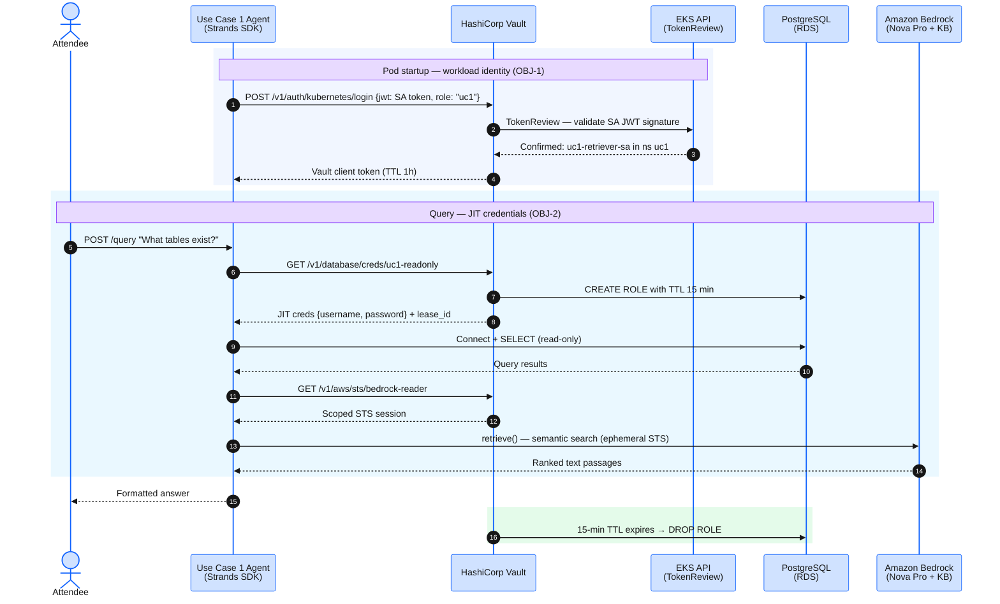
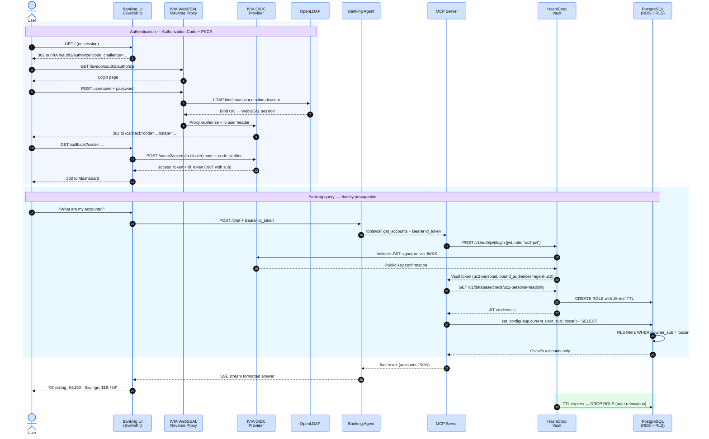
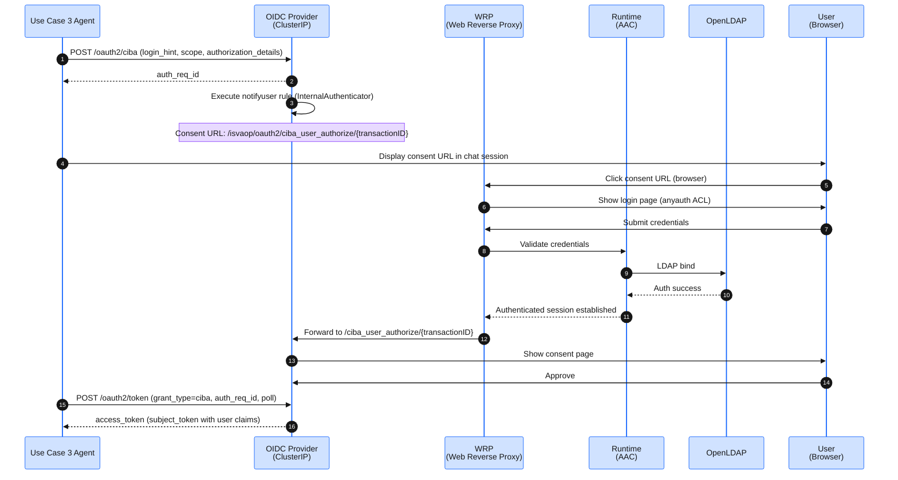

# Agentic Runtime Security on AWS

### Solving Identity and Access Gaps in Agentic AI

IBM Verify Identity Access + HashiCorp Vault on Amazon EKS

  
  

**Presenter:** _<presenter name placeholder>_

Note:
We open with the enterprise problem — the same framing as the HashiCorp + IBM SKO message — then spend the rest of the deck on the workshop, which is a real, deployable implementation of it. IBM Verify Identity Access owns user identity; HashiCorp Vault owns workload identity and credential vending; AWS-native services are the runtime and the enforcement surface. Three use cases (UC1 → UC2 → UC3) layer strictly on each other.

---

## The Problem

AI agents break assumptions security tooling has relied on for two decades:

- **Non-deterministic** — agents self-direct across databases, APIs, and tools, unlike traditional applications
- **Legacy IAM fails** — built for humans and deterministic systems, not real-time agent decisions
- **Scale** — machine:human identities growing **45:1**; bearer tokens and standing DB GRANTs sprawl with every new agent

**Three trust planes, at once:** _who is asking?_ (user) · _which agent is acting?_ (workload) · _what credential hits Postgres / Bedrock?_ (data)

Note:
Agents are not users — they don't fit an IAM persona. They are not classic workloads either — sometimes acting on behalf of a user, sometimes autonomously, and the boundary moves request to request. When something goes wrong, "which user authorized this action?" is unanswerable across IdP, IAM, and database logs that share no correlation key. Most tooling owns one of the three planes and assumes the other two are someone else's problem. That assumption is what this workshop dismantles.

---

## Four Critical Risk Areas

- **Over-privilege without visibility** — agents accumulate standing access far beyond need; massive blast radius if compromised
- **No real-time enforcement** — the last mile is unguarded when agents invoke tools and APIs; end-to-end security breaks
- **Impersonation & invisible delegation** — breaks audit trails; you can't answer _"who authorized this?"_
- **Zero accountability** — new models reach production without proper access and compliance controls

Note:
This is the threat-modeling lens for agentic workloads. Each risk area maps directly to a control objective the workshop implements and then tests — including a deliberate bypass test that proves the control is real, not theater.

---

## Why Action Is Urgent Now

| Force | What's happening |
|---|---|
| **Security threat** | Agent compromise is the fastest-growing attack vector — poor detection, high breach cost |
| **Regulatory pressure** | SOC 2, GDPR, PCI-DSS demand unique agent identity, audit trails, instant revocation |
| **Operational sprawl** | Hundreds of agents planned — privilege creep and compounding compliance debt |

Note:
The market forces are converging now. The regulatory column is the one most teams underestimate: unique agent identity, correlated audit trails, and instant revocation are becoming table stakes — exactly the three things the workshop builds and demonstrates end-to-end.

---

## Five Enterprise Imperatives

1. **Register every agent** — unique, cryptographically bound identity; no shared keys
2. **Strip standing privileges** — just-in-time, scoped access; authority expires automatically
3. **Tie actions to intent** — capture consent, purpose, sponsorship; traceable and instantly revocable
4. **Enforce at the point of use** — every API call validated against policy; nothing executes outside boundaries
5. **Produce proof of control** — audit answers in seconds; cryptographically signed evidence

Note:
These five imperatives are the spine of the whole story. The workshop implements each one as a concrete control objective on real infrastructure — that mapping is the next slide.

---

# From Imperatives to Implementation

### The workshop deploys all five — on AWS EKS

| Enterprise imperative | Workshop control objective |
|---|---|
| Register every agent | **OBJ-1** — Verifiable identity (K8s SA + OAuth JWT) |
| Strip standing privileges | **OBJ-2** — No standing privileges (JIT, TTL 5–15m) |
| Tie actions to intent | **OBJ-3** — Actions tied to user intent (PKCE, CIBA, RAR) |
| Enforce at the point of use | **OBJ-4** — Enforcement at point of use (policy · DB · network) |
| Produce proof of control | **OBJ-5** — Correlated audit (one `request_id`, three planes) |

Note:
This is the hinge of the deck. Everything before was the "why"; everything after is the "how" — IBM Verify Identity Access, HashiCorp Vault, and Amazon EKS / RDS / Bedrock / Athena turning five sentences into running, testable infrastructure. Each objective layers on the previous one.

---

## Responsibility Segregation

**IBM Verify** owns Identity & Access — human auth, SSO, OAuth, CIBA. **HashiCorp Vault** owns Secrets & Credential vending — non-human identity, policy enforcement, JIT external brokering.

Note:
Leveraging the right technology for each plane aligns to industry standards and is usually owned by different teams. IBM Verify handles human authentication, single sign-on, OAuth integration for the AI runtime, and CIBA out-of-band approval. HashiCorp Vault handles non-human identity, centralized policy enforcement, JIT credential vending, and 1-to-many external brokering. The rule: Verify never sees the database; Vault never authenticates an end user. They meet at exactly one OIDC-mediated seam.

---

## Reference Architecture

IBM Verify + HashiCorp Vault credential-vending backbone — on AWS-native services

Note:
Keep this open in a second window. IBM Verify owns the user-identity plane; Vault owns workload identity and credential vending; AWS-native services are the runtime and the enforcement surface. The two systems meet at one seam — Vault's JWT auth trusts IVIA's OIDC discovery (JWKS) — which is where user intent becomes a Vault-vended, short-lived credential.

---

## Leveraging AWS-Native Services

| Service | Security role |
|---|---|
| **Amazon EKS** (1.34) | Workload runtime; OIDC provider anchors workload identity |
| **Amazon RDS PostgreSQL 17** | pgaudit + Row-Level Security; Vault-vended dynamic creds |
| **Amazon Bedrock** | Nova Pro inference + Nova 2 embeddings; reached via Vault AWS STS |
| **OpenSearch Serverless + S3** | Knowledge Base vector store + corpus |
| **AWS KMS** | Single CMK encrypts RDS, S3, AOSS, CloudWatch |
| **Amazon Athena** | Cross-plane audit-correlation query |

Note:
Every credential to these services is Vault-vended and short-lived (TTL 5–15 min) — no standing keys on any pod. AWS primitives do the enforcement: RDS enforces Row-Level Security and records pgaudit, KMS encrypts every store under one workshop CMK, Athena answers the auditor's cross-plane question. Verify and Vault broker identity and credentials; AWS enforces and audits at the point of use.

---

# Three Use Cases

### UC1 → UC2 → UC3 — each a strict superset of the previous

Non-personalized → personalized → privileged + audit correlation

Note:
These mirror the three SKO implementation patterns. UC1 = non-personalized (no user context, no consent). UC2 = personalized (OAuth Authorization Code + PKCE, user consent). UC3 = personalized AND privileged (CIBA out-of-band delegation). They are intentionally not reorderable — each builds on the last.

---

### Use Case 1 — Non-personalized Read-Only

agent SA → Vault K8s auth → JIT R/O Postgres + scoped Bedrock STS &nbsp;·&nbsp; OBJ-1, 2, 5

Note:
The simplest pattern — a retrieval agent with no notion of "user," answering questions that are the same for everyone. It runs on ServiceAccount `uc1-retriever-sa`, authenticates to Vault via the Kubernetes auth method, and receives a short-lived R/O Postgres credential plus a scoped Bedrock STS credential. No JWT yet. No user consent required. If UC1 doesn't work cleanly, none of the harder cases will.

---

### Use Case 2 — OAuth Personalized Read-Only

user OAuth + PKCE → user JWT → Vault jwt auth → per-user RLS-scoped creds &nbsp;·&nbsp; + OBJ-3, 4

Note:
The user enters. IVIA runs Authorization Code + PKCE and mints a user JWT carrying user context and session ID; the agent presents it to Vault's JWT auth method, which issues per-user credentials. PostgreSQL Row-Level Security scopes rows to `app.current_user_sub`. We prove enforcement by attempting an INSERT on a read-only credential (Postgres rejects it) and egress to an unapproved endpoint (NetworkPolicy blocks it).

---

### Use Case 3 — CIBA Privileged + Audit Correlation

CIBA approval → token-exchange JWT w/ may_act (RFC 8693) + authorization_details (RFC 9396) → Vault bound_claims → 5-min write creds &nbsp;·&nbsp; all 5

Note:
A privileged banking action triggers an out-of-band CIBA approval — a real-time push to the user's device. The user approves; IVIA mints a JWT carrying may_act (Token Exchange delegation) and authorization_details (RAR, task-specific fine-grained permission) claims; Vault validates them via bound_claims and issues a 5-minute write credential. Then the bypass test — forge a may_act claim and watch Vault reject it — proves the controls are real.

---

## One `request_id`, Three Planes

A single **Athena** query JOINs **IVIA decision log + Vault audit log + RDS pgaudit log**

Note:
The pedagogical money shot, and the answer to the SKO "produce proof of control" imperative. The request_id propagates through every hop; one Athena query joins the three log stores and answers: which user authorized this privileged action, when, against what resource, and was access revoked? Audit separation is maintained — Verify logs the decision, Vault logs the credential, Postgres logs the write — yet they correlate.

---

## The Agentic Runtime Security Journey

Progressive maturity on HashiCorp Vault + IBM Verify

- **Discover** — inventory models, agents, external connections; confirm OAuth / SPIFFE / Cloud Identity
- **Integrate** — agent identity + credentials via Vault; user auth via Verify; CIBA for privileged ops
- **Observe** — agent access patterns and credential usage; tighten policies in Verify and Vault
- **React** — auth-denied violations in Vault · policy violations in Verify · failed CIBA requests

Note:
The workshop drops you at the Integrate/Observe stages with a working reference. Forward-looking: Vault's native AI agent support (May 2026) adds an agent registry, 4-layer policy intersection, on-behalf-of delegation, and ephemeral authorization — the same patterns this workshop wires by hand become first-class.

---

<!-- .slide: data-state="thankyou" -->

# Thank You

### Q&A

**Workshop URL:** _<workshop URL placeholder>_

**Repo:** _<repo URL placeholder>_

Note:
Three takeaways: every agent needs a verifiable identity traceable to a signing authority, not a shared secret; every credential must be JIT-issued and short-lived with the revocation path tested; and audit evidence is only useful if it correlates across trust planes. IBM Verify + HashiCorp Vault on AWS-native services delivers all three — and you just deployed it.
