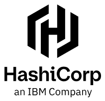
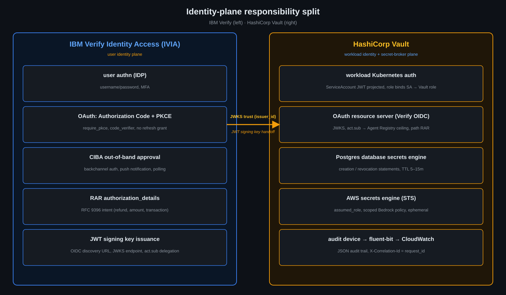
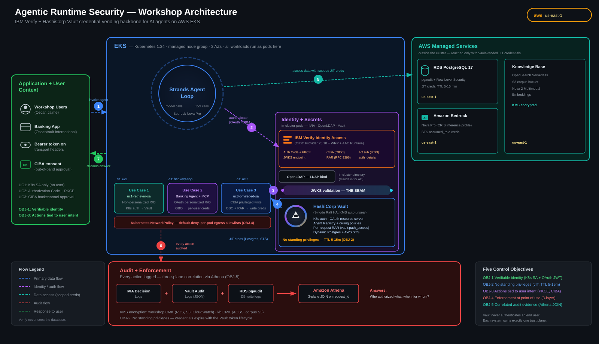
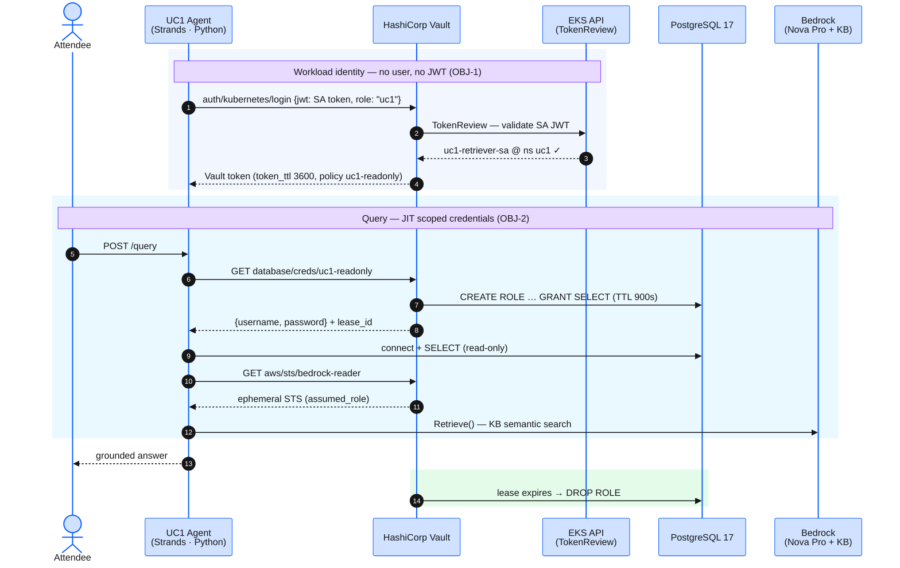
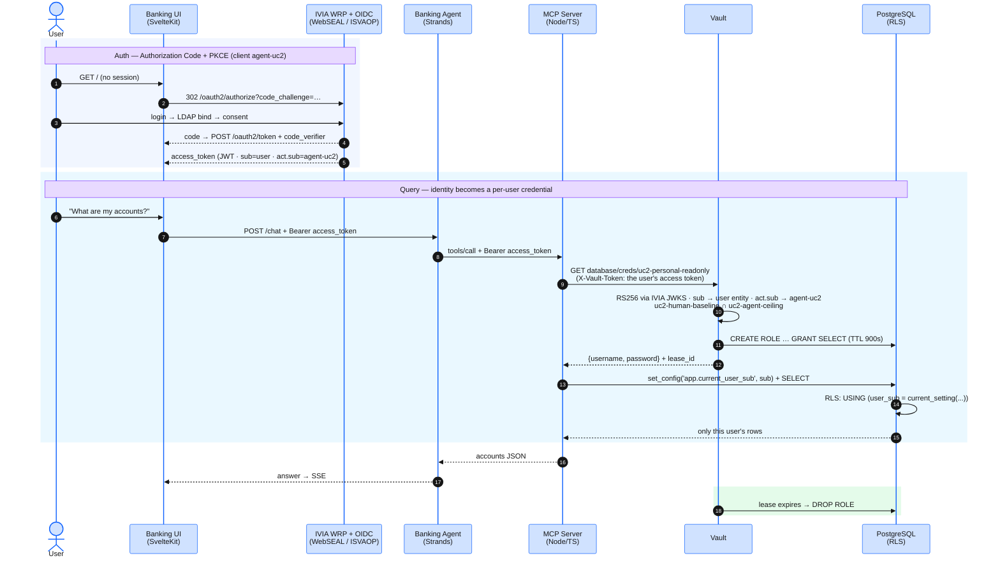
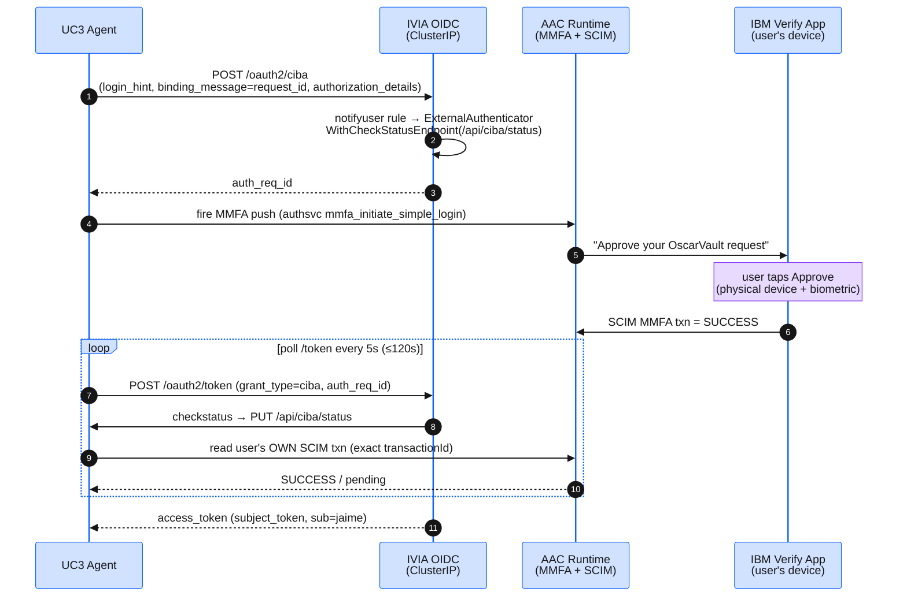
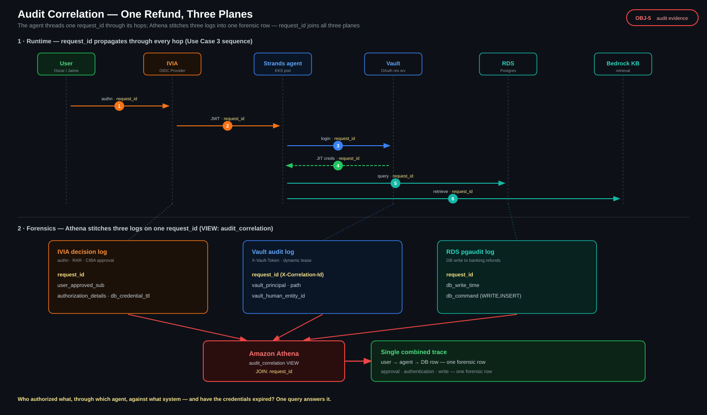

<style>
/* PDF export: `reveal-md slides.md --print slides.pdf --print-size 1280x720`.
   --print-size 1280x720 is REQUIRED so the printed page matches the 16:9 slide.
   The deck sets reveal `margin: 0` on purpose: reveal sizes its expected PDF page
   as slideWidth*(1+margin) and centers the slide in it, but --print-size pins the
   real page to 1280 — any non-zero margin shifts the slide right and clips its
   right edge. margin:0 keeps reveal's expected page == the printed page. Gutters
   below are added via content max-width (reveal forces section padding:0). */
.reveal .slides section > * { max-width: 1180px; margin-left: auto; margin-right: auto; }
/* Dense slides (heavy intro + bullets + closing, or a wide 4-col table) overflow
   the slide vertically/horizontally; shrink them proportionally so the title clears
   the logo and wide tables fit. Applied via `<!-- .slide: class="dense" -->`. */
.reveal .slides section.dense { font-size: 0.84em; }
/* The one dense slide with a table (Vault-native primitives) has a wide 4-col
   table whose long last-column strings won't wrap; fixed layout + full width
   forces them to wrap inside the page instead of overrunning the right edge.
   Scoped to .dense so the other (narrower) tables keep their natural sizing. */
.reveal .slides section.dense table { table-layout: fixed; width: 100%; }
.reveal section .mermaid { text-align: center; margin: 0 auto; }
.reveal section .mermaid svg { max-height: 440px !important; max-width: 96%; height: auto !important; width: auto; }
.reveal section .uc-footer { font-size: 0.5em; color: #555; margin-top: 6px; }
.reveal section pre code { font-size: 0.66em; line-height: 1.22; }
.reveal section table { font-size: 0.5em; width: auto; }
.reveal section td, .reveal section th { padding: 3px 7px; }
.reveal section .tight li { margin: 2px 0; }
.reveal .slides section { overflow: hidden; }
.reveal section pre { max-width: 100%; }
</style>

# Agentic Runtime Security on AWS


<div style="display:flex; gap:40px; align-items:center; justify-content:center; margin-top:24px;">
  
  
</div>

**Presenter:** _<presenter name placeholder>_

Note:
This is a real, deployable reference implementation, not a concept deck. Thesis in one line: no agent in this system ever holds a standing database grant or a static cloud key — every credential is brokered just-in-time, scoped to the exact action, and expires on a short TTL. IBM Verify Identity Access (IVIA) owns user identity; HashiCorp Vault owns workload identity and credential vending; AWS-native services (EKS, RDS, Bedrock, Athena, KMS) are the runtime and the enforcement-and-audit surface. Three use cases layer strictly: UC1 workload-only, UC2 user-scoped, UC3 privileged + delegated + audited. UC3 is where we'll spend most of our time.

---

## The credential problem agents create

<div class="tight">

- **Agents are neither users nor classic workloads** — sometimes acting autonomously, sometimes on behalf of a user; the boundary moves request to request
- **Standing secrets don't fit** — a long-lived DB user or static IAM key on a pod is blast radius that survives the request that needed it
- **Bearer tokens sprawl** — machine:human identity ratio ~**45:1**; every new agent multiplies the standing-grant inventory
- **Three identity questions, simultaneously** — _who is asking?_ (user) · _which workload is acting?_ (agent) · _what credential touches Postgres / Bedrock?_ (data)

</div>

The hard part is binding all three together for one action — and being able to prove it afterward.

Note:
Legacy IAM answers "who is asking" for humans and "which workload" for deterministic services, but it was never designed for a process that switches between autonomous and delegated within a session. The failure mode isn't exotic: a compromised agent with a standing read/write DB user and a static Bedrock key is a durable foothold. The fix is to stop issuing durable things. The rest of the deck is the mechanics of that.

---

## The invariant: nothing standing, everything brokered

Every credential an agent uses is **minted on demand, scoped to the action, and short-lived**:

| Credential | How it's obtained | TTL |
|---|---|---|
| Vault workload token _(every agent pod)_ | K8s SA JWT, validated by TokenReview | ≤ 1h (`token_ttl 3600`) |
| Postgres **read** role | `database/creds/*-readonly` — Vault `CREATE ROLE` per request | **15m** (`900s` / max `1800s`) |
| Postgres **write** role (UC3) | `database/creds/uc3-refund-writer` — gated on delegated JWT | **5m** (`300s` / max `600s`) |
| AWS STS (Bedrock) | `aws/sts/bedrock-reader` — `assumed_role`, vended per call | Ephemeral STS session |

No pod ships with a DB password or a static AWS key. UC2/UC3 present the IVIA OAuth JWT **directly** to Vault (`X-Vault-Token`) — no intermediate Vault token. Lease expiry → Vault `DROP ROLE`.

Note:
This table is the whole thesis made concrete, and the numbers are exact from `vault_config`. Reads get 15-minute Postgres roles; the one privileged write path gets 5 minutes and only after a human approves. Bedrock is never reached with a baked-in key — Vault's AWS secrets engine assumes a role and hands back an ephemeral STS session scoped to `bedrock:InvokeModel`/`Retrieve`. Revocation is not a separate system: when the lease ends Vault drops the Postgres role, so a leaked credential is dead in minutes whether or not anyone noticed.

---

## Two brokers, one OIDC seam



**IBM Verify** brokers human identity — OAuth/OIDC, PKCE, CIBA. **HashiCorp Vault** brokers workload identity & credentials — K8s auth, OAuth resource server, dynamic DB roles, STS. They meet at exactly **one** seam: Vault's **OAuth resource server** profile trusts IVIA's JWKS and pins `issuer_id`, so an IVIA-minted JWT authorizes Vault **directly** via `X-Vault-Token`.

Note:
Clean separation of duties, usually different teams. Verify never sees a database; Vault never authenticates an end user. The single integration point is OIDC: Vault's OAuth resource server profile (`sys/config/oauth-resource-server/ivia`) is configured with IVIA's JWKS and pins `issuer_id` to IVIA's issuer. A user (or delegated) token minted by IVIA is presented directly on the Vault request as `X-Vault-Token` — there is no `auth/jwt/login` step and no intermediate Vault token; the legacy `jwt` auth backend is retired. That seam is where "user intent" crosses into "workload credential" — and it's the only place the two systems touch.

---

## Reference architecture



IVIA + Vault credential-vending backbone on AWS-native services — EKS 1.34 · RDS PostgreSQL 17 · Bedrock · Athena

Note:
Keep this open in a second window. IVIA owns the user-identity plane; Vault owns workload identity and credential vending; AWS-native services are the runtime and the enforcement surface. Everything in the cluster authenticates to Vault — there is no other source of database or cloud credentials.

---

## AWS-native enforcement & audit surface

| Service | Security role |
|---|---|
| **Amazon EKS** (1.34) | Workload runtime; Vault **Kubernetes auth** validates pod SA tokens via **TokenReview**, issuer pinned to the cluster OIDC issuer |
| **Amazon RDS PostgreSQL 17** | **pgaudit** + **Row-Level Security**; only Vault-vended dynamic roles connect |
| **Amazon Bedrock** | Nova Pro inference (`us.amazon.nova-pro-v1:0`, CRIS) + Nova 2 embeddings; reached via **Vault AWS STS** |
| **OpenSearch Serverless + S3** | Bedrock Knowledge Base vector store + corpus |
| **AWS KMS** | Three CMKs: `workshop` (RDS, audit logs, CloudWatch, Athena results) · `kb` (AOSS, corpus S3) · `vault_unseal` (Vault auto-unseal) |
| **Amazon Athena** | Cross-plane audit correlation (`audit_correlation` view) |

Single region: **us-east-1**, where Nova 2 Multimodal Embeddings runs. Enforcement lives in the AWS primitives — Vault brokers, AWS enforces and records.

Note:
The division of labor matters for an expert audience: Verify and Vault decide identity and vend credentials, but the actual enforcement is AWS-native. RDS enforces RLS and writes pgaudit; Vault's Kubernetes auth validates each pod's ServiceAccount token with a TokenReview against the EKS API server, with the token issuer pinned to the cluster's OIDC issuer; three customer-managed keys encrypt every store — `workshop` (RDS, the audit log bucket, CloudWatch log groups, Athena results), `kb` (AOSS, corpus S3) and a dedicated `vault_unseal` key kept separate so Vault's unseal calls are distinguishable from storage encryption; Athena answers the auditor's question. Nova Pro is the cross-region inference profile id (`us.` prefix — the bare id is rejected for on-demand throughput); Nova 2 Multimodal Embeddings is us-east-1 only, which is why the whole workshop runs in us-east-1.

---

# Three use cases

### UC1 → UC2 → UC3 — each adds a scoping dimension

workload-only → user-scoped rows → privileged write + delegated identity + audit

Note:
Not reorderable. UC1 proves workload identity with no user in the picture. UC2 adds a real user and scopes data to that user's rows. UC3 adds a privileged action that requires out-of-band human approval, a delegated identity, and a correlated audit trail. The first two are deliberately the "easy" cases — but note they are not unsecured: even the read-only retrieval agent holds zero standing credentials. UC3 is the hero.

---

### UC1 — workload identity, JIT read credentials


```mermaid
%%{init: {'theme': 'base', 'themeVariables': {
  'primaryColor': '#d0e2ff', 'primaryTextColor': '#161616', 'primaryBorderColor': '#0f62fe',
  'lineColor': '#0f62fe', 'secondaryColor': '#bae6ff', 'tertiaryColor': '#f4f4f4',
  'noteBkgColor': '#e8daff', 'noteTextColor': '#161616', 'noteBorderColor': '#8a3ffc',
  'actorBkg': '#d0e2ff', 'actorBorder': '#0f62fe', 'actorTextColor': '#161616',
  'signalColor': '#161616', 'signalTextColor': '#161616', 'sequenceNumberColor': '#ffffff'
}}}%%
sequenceDiagram
    autonumber
    actor Attendee
    participant Agent as UC1 Agent<br/>(Strands · Python)
    participant Vault as HashiCorp Vault
    participant EKS as EKS API<br/>(TokenReview)
    participant RDS as PostgreSQL 17
    participant Bedrock as Bedrock<br/>(Nova Pro + KB)

    rect rgba(208, 226, 255, 0.3)
    Note over Agent,EKS: Workload identity — no user, no JWT (OBJ-1)
    Agent->>Vault: auth/kubernetes/login {jwt: SA token, role: "uc1"}
    Vault->>EKS: TokenReview — validate SA JWT
    EKS-->>Vault: uc1-retriever-sa @ ns uc1 ✓
    Vault-->>Agent: Vault token (token_ttl 3600, policy uc1-readonly)
    end

    rect rgba(186, 230, 255, 0.3)
    Note over Attendee,Bedrock: Query — JIT scoped credentials (OBJ-2)
    Attendee->>Agent: POST /query
    Agent->>Vault: GET database/creds/uc1-readonly
    Vault->>RDS: CREATE ROLE … GRANT SELECT (TTL 900s)
    Vault-->>Agent: {username, password} + lease_id
    Agent->>RDS: connect + SELECT (read-only)
    Agent->>Vault: GET aws/sts/bedrock-reader
    Vault-->>Agent: ephemeral STS (assumed_role)
    Agent->>Bedrock: Retrieve() — KB semantic search
    end

    Agent-->>Attendee: grounded answer
    rect rgba(167, 240, 186, 0.3)
    Vault->>RDS: lease expires → DROP ROLE
    end
```

<p class="uc-footer">K8s SA → Vault kubernetes auth → SELECT-only Postgres role (900s) + scoped Bedrock STS &nbsp;·&nbsp; OBJ-1, 2, 5</p>

Note:
The simplest pattern — a retrieval agent with no notion of "user." It runs on ServiceAccount `uc1-retriever-sa` in namespace `uc1`, authenticates to Vault's Kubernetes auth method (role `uc1`, which binds exactly that SA + namespace), and Vault validates the SA token via a TokenReview against the EKS API server. UC1 is also registered in the Agent Registry (`uc1-agent`), but its ceiling is inert — a Kubernetes token carries no `act.sub` — so the `uc1-readonly` policy is the enforcement floor. It then gets a 15-minute SELECT-only Postgres role and an ephemeral Bedrock STS session — never a static key. Security takeaway: even the trivial case ships zero standing credentials. If UC1 doesn't hold, nothing harder will.

---

### UC2 — user identity propagation + per-row scoping


```mermaid
%%{init: {'theme': 'base', 'themeVariables': {
  'primaryColor': '#d0e2ff', 'primaryTextColor': '#161616', 'primaryBorderColor': '#0f62fe',
  'lineColor': '#0f62fe', 'secondaryColor': '#bae6ff', 'tertiaryColor': '#f4f4f4',
  'noteBkgColor': '#e8daff', 'noteTextColor': '#161616', 'noteBorderColor': '#8a3ffc',
  'actorBkg': '#d0e2ff', 'actorBorder': '#0f62fe', 'actorTextColor': '#161616',
  'signalColor': '#161616', 'signalTextColor': '#161616', 'sequenceNumberColor': '#ffffff'
}}}%%
sequenceDiagram
    autonumber
    actor User
    participant UI as Banking UI<br/>(SvelteKit)
    participant IVIA as IVIA WRP + OIDC<br/>(WebSEAL / ISVAOP)
    participant Agent as Banking Agent<br/>(Strands)
    participant MCP as MCP Server<br/>(Node/TS)
    participant Vault as Vault
    participant RDS as PostgreSQL<br/>(RLS)

    rect rgba(208, 226, 255, 0.3)
    Note over User,IVIA: Auth — Authorization Code + PKCE (client agent-uc2)
    User->>UI: GET / (no session)
    UI->>IVIA: 302 /oauth2/authorize?code_challenge=…
    User->>IVIA: login → LDAP bind → consent
    IVIA-->>UI: code → POST /oauth2/token + code_verifier
    IVIA-->>UI: access_token (JWT · sub=user · act.sub=agent-uc2)
    end

    rect rgba(186, 230, 255, 0.3)
    Note over User,RDS: Query — identity becomes a per-user credential
    User->>UI: "What are my accounts?"
    UI->>Agent: POST /chat + Bearer access_token
    Agent->>MCP: tools/call + Bearer access_token
    MCP->>Vault: GET database/creds/uc2-personal-readonly<br/>(X-Vault-Token: the user's access token)
    Vault->>Vault: RS256 via IVIA JWKS · sub → user entity · act.sub → agent-uc2<br/>uc2-human-baseline ∩ uc2-agent-ceiling
    Vault->>RDS: CREATE ROLE … GRANT SELECT (TTL 900s)
    Vault-->>MCP: {username, password} + lease_id
    MCP->>RDS: set_config('app.current_user_sub', sub) + SELECT
    RDS->>RDS: RLS: USING (user_sub = current_setting(...))
    RDS-->>MCP: only this user's rows
    end

    MCP-->>Agent: accounts JSON
    Agent-->>UI: answer → SSE
    rect rgba(167, 240, 186, 0.3)
    Vault->>RDS: lease expires → DROP ROLE
    end
```

<p class="uc-footer">user access token (PKCE) → agent → MCP → Vault OAuth resource server (X-Vault-Token, OBO) → SELECT-only role + RLS on <code>user_sub</code> &nbsp;·&nbsp; + OBJ-3, 4</p>

Note:
The user enters. IVIA runs Authorization Code + PKCE for client `agent-uc2` and mints a JWT access token with `sub` = the user; IVIA's `isvaop_pretoken` rule stamps `act.sub=agent-uc2` on it, so the login token is already an on-behalf-of delegation to the banking agent. The client has no refresh grant, so that agent identity can only be minted on a fresh interactive login. The UI forwards the access token to the banking agent (Strands), which forwards it to the MCP server (Node/TypeScript); the MCP server presents it **directly** to Vault as `X-Vault-Token` on the `database/creds` read — no `auth/jwt/login`, no intermediate token. Vault's OAuth resource server profile checks the RS256 signature against IVIA's JWKS and the pinned `issuer_id`, resolves `sub` to the user's Vault entity and `act.sub` to the registered `agent-uc2`, and grants only the intersection: `uc2-human-baseline` ∩ `uc2-agent-ceiling`. UC2's registration allows a per-request RAR but the token carries none, so those two layers decide. Vault issues a 15-minute SELECT-only Postgres role; the MCP server calls `set_config('app.current_user_sub', <sub>)` and Postgres RLS policy `user_accounts USING (user_sub = current_setting('app.current_user_sub', true))` filters every row. The banking agent's own Bedrock access is separate: its pod logs in with Kubernetes auth (role `uc2-agent`) for an STS session. Two enforcement dimensions get added here, proven on the next slide.

---

### UC2 — enforcement is tested, not asserted

Two negative tests ship in `verify-uc2.sh`:

<div class="tight">

- **ENFC-02 — read-only means read-only.** An `INSERT` on `banking.accounts` using the `uc2-personal-readonly` credential is rejected by Postgres: `permission denied for table accounts`. The grant is `SELECT`-only; there is no application code path to "accidentally" widen it.
- **ENFC-03 — egress is default-deny.** The MCP pod's `NetworkPolicy` allows egress to **only** Vault (8200), RDS (5432), and IVIA (443). A `wget` to any external host (`httpbin.org`) is `BLOCKED`.

</div>

A control you haven't tried to bypass is a control you haven't verified.

Note:
This is the slide that earns credibility with a security audience. We don't claim least privilege — we attempt the privilege and show the rejection. ENFC-02 proves the database itself enforces the read-only boundary, independent of agent code. ENFC-03 proves the agent can't exfiltrate or call out to an unapproved endpoint even if compromised, because the Kubernetes NetworkPolicy is an allowlist of three destinations. Both are real `kubectl`-driven checks in the verify script, not stubs.

---

# Use Case 3 — the hero

### Privileged write = human approval + delegated identity + bound, 5-minute credential

Three standards composed: **OIDC CIBA** · **RFC 8693** token exchange · **RFC 9396** RAR

Note:
UC3 is a privileged action — issuing a refund that writes to the database. Everything tightens: the human must approve out-of-band on a physical device; the agent's identity must be cryptographically delegated, not assumed; and the write credential is gated on claims that only a genuine delegation can carry, then expires in five minutes. Three OAuth/OIDC standards do the work, and Vault is the point-of-use gate. We'll walk the flow, the token, the Vault gate, and the bypass test that proves the gate is real.

---

### UC3 — CIBA out-of-band approval (mobile push)


```mermaid
%%{init: {'theme': 'base', 'themeVariables': {
  'primaryColor': '#d0e2ff', 'primaryTextColor': '#161616', 'primaryBorderColor': '#0f62fe',
  'lineColor': '#0f62fe', 'secondaryColor': '#bae6ff', 'tertiaryColor': '#f4f4f4',
  'noteBkgColor': '#e8daff', 'noteTextColor': '#161616', 'noteBorderColor': '#8a3ffc',
  'actorBkg': '#d0e2ff', 'actorBorder': '#0f62fe', 'actorTextColor': '#161616',
  'signalColor': '#161616', 'signalTextColor': '#161616', 'sequenceNumberColor': '#ffffff'
}}}%%
sequenceDiagram
    autonumber
    participant Agent as UC3 Agent
    participant OP as IVIA OIDC<br/>(ClusterIP)
    participant RT as AAC Runtime<br/>(MMFA + SCIM)
    participant Phone as IBM Verify App<br/>(user's device)

    Agent->>OP: POST /oauth2/ciba<br/>(login_hint, binding_message=request_id, authorization_details)
    OP->>OP: notifyuser rule → ExternalAuthenticator<br/>WithCheckStatusEndpoint(/api/ciba/status)
    OP-->>Agent: auth_req_id
    Agent->>RT: fire MMFA push (authsvc mmfa_initiate_simple_login)
    RT->>Phone: "Approve your OscarVault request"
    Note over Phone: user taps Approve<br/>(physical device + biometric)
    Phone->>RT: SCIM MMFA txn = SUCCESS
    loop poll /token every 5s (≤120s)
        Agent->>OP: POST /oauth2/token (grant_type=ciba, auth_req_id)
        OP->>Agent: checkstatus → PUT /api/ciba/status
        Agent->>RT: read user's OWN SCIM txn (exact transactionId)
        RT-->>Agent: SUCCESS / pending
    end
    OP-->>Agent: access_token (subject_token, sub=jaime)
```

<p class="uc-footer">backchannel CIBA · machine-to-machine · approval is a physical tap, matched to the exact MMFA transaction</p>

Note:
This is the deployed reality — mobile push, not a browser consent page. The agent POSTs `/oauth2/ciba` directly to the OIDC Provider ClusterIP (bypasses the WRP — it's machine-to-machine) with `login_hint` = the authenticated user, `binding_message` = the request_id audit anchor, and the refund `authorization_details`. IVIA's `notifyuser` rule wires completion to a server-polled check-status endpoint on the agent. The agent fires the MMFA push to the user's enrolled IBM Verify device. Unforgeable because two independent facts must hold: the user physically taps Approve, AND the agent confirms the exact MMFA transaction it fired — matched by `transactionId`, never "any SUCCESS for the user" — resolved to SUCCESS in that user's own SCIM record. Identity comes from the authenticated session, never an LLM parameter.

---

### UC3 — delegation: RFC 8693 token exchange

The CIBA token proves the user approved. It does **not** prove which agent is acting. Token exchange produces a delegated JWT that carries both.

```text
POST /oauth2/token
  grant_type    = urn:ietf:params:oauth:grant-type:token-exchange
  subject_token = <CIBA user access_token>          # proves user + consent
  (client auth  = uc3-actor, HTTP Basic)            # NO actor_token sent — IVIA
                                                    # rejects self-exchange (FBTAQ5207E)
```

IVIA's `isvaop_pretoken` mapping rule stamps the delegated JWT **server-side**:

```jsonc
{
  "sub": "jaime",                                   // the human who approved (CIBA)
  "act":     { "sub": "uc3-actor" },                // RFC 8693 — the claim Vault RESOLVES the agent from
  "may_act": { "sub": "uc3-actor" },                // retained for RFC 8693 audit semantics (Vault ignores it)
  "authorization_details": [
    { "type": "refund_approval" },                  // RFC 9396 business RAR — the audit story (no amount claim)
    { "type": "vault:path_access",                  // RFC 9396 Vault-native RAR — the ENFORCED path
      "path": "database/creds/uc3-refund-writer",
      "capabilities": ["read"] }
  ]
}
```

<p class="uc-footer">delegation + RAR are injected by IVIA, not asserted by the agent — the agent cannot forge its own authority</p>

Note:
The key technical point an expert will probe: the agent authenticates the exchange as a separate OAuth client (`uc3-actor`) and presents only the user's subject_token — no `actor_token`, and it stamps none of these claims itself; IVIA refuses a client exchanging its own token (FBTAQ5207E). IVIA's `isvaop_pretoken` mapping rule injects them server-side: `act.sub` is the load-bearing claim Vault's native OBO resolves the agent from (proven in 09-DISCOVERY — `act.sub`→resolves/allow, `may_act.sub`→ignored/deny); `may_act` is retained purely for RFC 8693 audit semantics; and two `authorization_details` entries ride along — the business `refund_approval` (the audit story) and the `vault:path_access` RAR (the path Vault actually enforces). So the proof of who may act is minted by the identity provider, not claimed by the workload — which is what makes it trustworthy at the Vault gate.

---

### UC3 — the Vault gate (OBJ-4 point of use)

The delegated JWT is presented **directly** to Vault as `X-Vault-Token` on the `database/creds/uc3-refund-writer` read. The OAuth resource server validates the signature (RS256, IVIA JWKS, `issuer_id`), then Vault issues **nothing** unless all three layers intersect:

```text
① identity    sub = jaime           -> the human's Vault entity            (baseline)
② delegation  act.sub = uc3-actor   -> resolves the acting agent in the Agent Registry;
                                        applies the uc3-agent-ceiling (restrict-only)
③ per-request authorization_details type = vault:path_access,
   RAR        path = database/creds/uc3-refund-writer   (must match the path being read)
              MANDATORY: the uc3-actor registration sets optional_authorization_details=false
```

Effective grant = ① baseline ∩ ② ceiling ∩ ③ RAR. Miss any one → deny — then, and only then: `database/creds/uc3-refund-writer` — `GRANT SELECT, INSERT, UPDATE ON banking.refunds` (no DELETE), **TTL 300s**, **not** `BYPASSRLS`.

<p class="uc-footer">amount is NOT a claim — ISVAOP can't expose consent-time RAR to a mapping rule; it's consent-bound via audit correlation</p>

Note:
Vault denies the write credential unless the signature validates against IVIA's JWKS (RS256) AND all three layers intersect: the `sub` resolves to jaime's entity (baseline), the `act.sub` resolves the `uc3-actor` agent in the Agent Registry and applies its `uc3-agent-ceiling`, and the per-request `vault:path_access` RAR path matches the creds path being read. The RAR is mandatory here — the `uc3-actor` registration sets `optional_authorization_details=false`, so a token with no RAR (or the wrong path) is denied. Two honesty points for a sharp audience: (1) the role is NOT `BYPASSRLS`, so RLS still applies to the write as defense-in-depth; (2) the approved amount is deliberately not a JWT claim — ISVAOP 25.10 doesn't expose the consent-time `authorization_details` to any mapping rule at mint or exchange, and a glob bound_claim couldn't enforce a number anyway. The amount is bound by the 1:1 `request_id` correlation between the CIBA approval and the single `banking.refunds` write — surfaced on the three-plane audit slide next. Credential lives 5 minutes.

---

### UC3 — the bypass tests prove the gate has teeth

<!-- .slide: class="dense" -->

`verify-uc3.sh --bypass` runs five negative gates against one positive control (Checks 15–16 — a **real** delegated token IS allowed to read the creds):

<div class="tight">

- **Check 14 — untrusted signer.** An **HS256** forgery whose claims match the allowed token exactly — only the signature differs → denied. Vault trusts only IVIA's **RS256** JWKS.
- **Check 17 — wrong RAR path.** The **same genuine** delegated token, presented to `database/creds/uc3-readonly` — a path its `vault:path_access` RAR does not name → `RAR_NO_MATCH`, although baseline and ceiling both permit it.
- **Check 18 — wrong agent.** A genuine UC2 token for the same human (`act.sub=agent-uc2`) → denied: `uc2-agent-ceiling` omits the refund path.
- **Check 20 — wrong client.** The identical RFC 8693 exchange is refused as `agent-uc2` (`unauthorized_client`); only `uc3-actor` gets past the client gate.
- **Check 21 — no approval.** The agent's own Kubernetes login asks for the refund-writer creds directly → `permission denied`; the same login can still read `uc3-readonly`.

</div>

17 and 18 are the strong ones: a legitimately IVIA-signed token is still denied because it names the wrong **path** or acts through the wrong **agent**.

Note:
Check 14 closes the obvious door — a forgery with a symmetric key dies at the signature layer, because Vault only accepts RS256 against IVIA's published keys; since Check 16 allows the same-shaped RS256 token, the denial is attributable to the signer alone. Checks 17 and 18 are the ones that land: the attacker can hold a real, IVIA-signed token and Vault still refuses the write credential if the per-request `vault:path_access` RAR names a different path (17) or the token was delegated to a different agent whose ceiling omits the refund path (18) — the agent ceiling isolates use cases even when the human could reach the path. Check 20 shows delegation can't be requested by any client that merely reaches the token endpoint, and Check 21 shows the agent pod's own identity can't skip the approval. A true wrong-actor token (Check 19) needs IVIA to sign an `act.sub` it never issues, so it is operator-supplied and skipped by default — Check 18 already proves the actor claim decides what the token can reach.

---

## One refund — three planes, one row



A single Athena view **`audit_correlation`** (12 cols) stitches **IVIA decision · Vault audit · RDS pgaudit** — all three join on the agent's **`request_id`**, which reaches Vault as an `X-Correlation-Id` header.

Note:
The pedagogical money shot — and here's the honest mechanism an expert will want. The UC3 agent writes a decision record to `/workshop/ivia-decision` carrying its `request_id` (it was the CIBA `binding_message`). The agent embeds that same UUID as a `/* uc3_request_id=… */` SQL comment, which pgaudit logs verbatim and the view regex-extracts. And it stamps the same UUID on the Vault credential read as an `X-Correlation-Id` header; Vault's audit device is configured to record that header unhashed, so the Vault plane joins on an exact equality too — deterministic even when two refunds land in the same second. Vault's own record also names both parties: `auth.entity_id` is the human's identity entity (`vault_human_entity_id`), and `auth.metadata['actor_entity_name']` is the Agent Registry actor Vault resolved from `act.sub` (`uc3-actor`) — not the IVIA `client_id` (`agent-uc3`, the CIBA exchange client that never authenticates to Vault). `vault_rar_path` is the exact `database/creds/…` path the per-request `vault:path_access` RAR scoped the token to. Three CloudWatch log groups → Firehose (decompress + extract) → S3 → Glue → one Athena view. The correlated row is on the next slide.

---

### `audit_correlation` — one row, three planes

| Column | Value |
|---|---|
| `request_id` | `21e88164-d561-43c8-9157-e6c8f732d070` |
| `approval_time` | `2026-09-02T22:21:50` |
| `user_approved_sub` | `jaime` |
| `ciba_binding_message` | `21e88164-d561-43c8-9157-e6c8f732d070` |
| `vault_auth_time` | `2026-09-02T22:21:49` |
| `vault_principal` | `uc3-actor (on behalf of jaime)` |
| `vault_human_entity_id` | `6edd531a-371a-7bb1-2290-fe520b73e0e8` |
| `vault_agent_registry_id` | `uc3-actor` |
| `vault_rar_path` | `database/creds/uc3-refund-writer` |
| `db_write_time` | `2026-09-02 22:21:50` |
| `db_command` | `WRITE,INSERT` |
| `db_credential_ttl` | `300` |

One row answers: **who approved, when, what claims Vault bound them to, what write landed, and the credential's TTL.**

Note:
This single row is the auditor's answer. The TTL column comes from the value the agent observed in the Vault creds response and threaded into its decision record — because the `database/creds` read response doesn't log a numeric duration. Read it across the three planes: jaime approved at 22:21:50; Vault authorized `uc3-actor (on behalf of jaime)` at 22:21:49 — the agent and the human's own Vault entity on one decision, scoped by the per-request `vault:path_access` RAR to `database/creds/uc3-refund-writer` at a 300-second TTL; RDS pgaudit recorded the INSERT at 22:21:50. The whole privileged window is about a second wide, and every plane joins on the same `request_id`.

---

## Three use cases → Vault-native primitives

<!-- .slide: class="dense" -->

Each use case maps onto Vault Enterprise 2.1.1's first-class agent features — not a hand-rolled approximation:

| Use Case | Vault-native primitive | Identity resolved from | Enforcement layers |
|---|---|---|---|
| **UC1** — workload read | Agent Registry (`uc1-agent`) + **Kubernetes auth** | SA token via TokenReview — ceiling **inert** (no `act.sub`) | **1** — `uc1-readonly` K8s floor |
| **UC2** — user-scoped read | **OAuth resource server** (`X-Vault-Token`) + OBO | `sub` **+** `act.sub` (`agent-uc2`) → entity aliases | **2** — `sub` baseline ∩ `uc2-agent-ceiling` (RAR optional, not sent) |
| **UC3** — delegated write | OBO + **mandatory** per-request RAR (`vault:path_access`) | `sub` **+** `act.sub` → entity aliases | **3** — baseline ∩ `uc3-agent-ceiling` ∩ *mandatory* RAR |

Shared by all three: every agent is a **registered** Agent Registry identity; the IVIA OAuth JWT authorizes Vault **directly** (legacy `jwt` backend retired); credentials are short-lived and Vault-vended.

Note:
This is the one-slide answer to "what did Vault's native agent support actually give us." UC1 uses the Agent Registry for identity but enforces at the Kubernetes-auth floor — its registry ceiling is inert because a K8s token carries no `act.sub` to resolve an agent. UC2 and UC3 both authenticate the IVIA OAuth JWT directly through the OAuth resource server (no `auth/jwt/login`) and enforce the on-behalf-of intersection: the human `sub` baseline intersected with the agent's ceiling policy. UC2's registration allows a RAR but its login token carries none, so UC2 enforces those two layers. UC3 adds the mandatory per-request `vault:path_access` RAR — the `uc3-actor` registration sets `optional_authorization_details=false`, so the exact path must be named on every request. Same three primitives — Agent Registry, OAuth resource server, per-request RAR — dialed to each use case's risk.

---

## Where this goes next

<!-- .slide: class="dense" -->

Progressive maturity on Vault + IBM Verify — the workshop drops you at **Integrate / Observe** with a working reference:

<div class="tight">

- **Discover** — inventory models, agents, external connections; confirm OAuth / SPIFFE / cloud identity
- **Integrate** — agent identity + JIT credentials via Vault; user auth + CIBA via Verify
- **Observe** — agent access patterns, credential usage, bound-claim metadata; tighten policy
- **React** — Vault auth-denied + Verify policy violations + failed CIBA as signals

</div>

Vault Enterprise 2.1.1's native AI agent support is what you deployed here — the **Agent Registry** (first-class agent identity), **ceiling-policy intersection**, on-behalf-of delegation, and Vault-side per-request **`vault:path_access`** authorization are the enforcement model, not a hand-rolled approximation.

Note:
This deck's patterns — verifiable agent identity, JIT short-lived scoped credentials, delegated authority, and cross-plane correlation — are Vault's native agent-identity primitives, and you deployed them running. Every agent is registered (`uc1-agent`, `agent-uc2`, `uc3-actor`); the IVIA OAuth JWT authorizes Vault directly via `X-Vault-Token` (the legacy `jwt` backend is retired); and Vault is the sole enforcement point. The layer count is honest per use case: Use Case 1 enforces one layer (the `uc1-readonly` Kubernetes floor; its ceiling is inert with no OAuth actor), Use Case 2 enforces two — the human `sub` baseline ∩ `uc2-agent-ceiling` (its RAR is optional and its token carries none) — and Use Case 3 enforces three — the human `sub` baseline ∩ `uc3-agent-ceiling` ∩ the mandatory per-request `vault:path_access` RAR. The reference you deployed is the model, not the on-ramp to it.

---

<!-- .slide: data-state="thankyou" -->


# Thank You

### Q&A

**Workshop URL:** _<workshop URL placeholder>_

**Repo:** _<repo URL placeholder>_

Note:
Three takeaways. One — every agent needs a verifiable identity traceable to a signing authority, never a shared secret; UC1 proves it with K8s SA + TokenReview. Two — every credential must be JIT, scoped, and short-lived, with the privileged path additionally gated on delegated claims and a tested bypass; UC3's 5-minute write role behind RFC 8693 + 9396 is the model. Three — audit evidence is only useful if it correlates across trust planes; one Athena view ties user approval, agent identity, and the database write together. IBM Verify + HashiCorp Vault on AWS-native services delivers all three — and you just deployed it.
