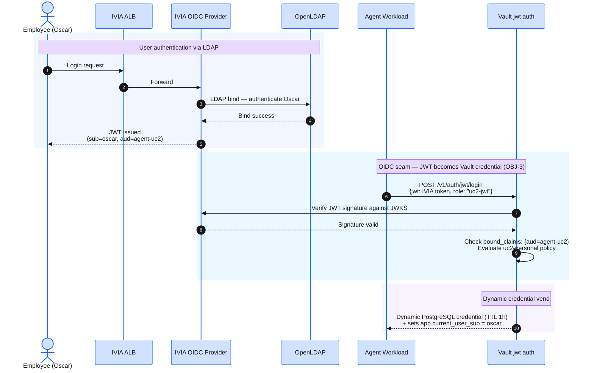

The OIDC seam is where an IVIA-issued JWT becomes a Vault-vended dynamic credential. `configure-workshop.sh` already wired Vault's `jwt` auth backend to trust IVIA — confirm the wiring is correct before running use cases.

## The OIDC Seam at Runtime



The `sub` claim from the JWT flows through Vault into the Postgres session variable that activates Row-Level Security — each user sees only their own data, enforced at the database layer.

Load the root token before running the checks below:

```bash
export VAULT_ROOT_TOKEN=$(jq -r '.root_token' ~/vault-init.json)
```

## Step 1 — Confirm Vault auth methods

```bash
kubectl exec -n vault vault-0 -- \
  sh -c "VAULT_TOKEN='${VAULT_ROOT_TOKEN}' vault auth list"
```

Expected:

```
Path           Type          Accessor                Description
----           ----          --------                -----------
kubernetes/    kubernetes    auth_kubernetes_...     Kubernetes workload auth
jwt/           jwt           auth_jwt_...            IVIA OIDC user auth
token/         token         auth_token_...          token based credentials
```

## Step 2 — Confirm secrets engines

```bash
kubectl exec -n vault vault-0 -- \
  sh -c "VAULT_TOKEN='${VAULT_ROOT_TOKEN}' vault secrets list"
```

Expected:

```
Path          Type         Description
----          ----         -----------
aws/          aws          Dynamic IAM credentials
database/     database     Dynamic PostgreSQL credentials
sys/          system       system endpoints used for control, policy and debugging
```

## Step 3 — Confirm JWT auth points to IVIA

```bash
kubectl exec -n vault vault-0 -- \
  sh -c "VAULT_TOKEN='${VAULT_ROOT_TOKEN}' vault read auth/jwt/config"
```

Expected:

```
jwks_url              https://iviaop.verify-access.svc.cluster.local:8436/oauth2/jwks
bound_issuer          https://k8s-verifyac-iviawrp-8b70662954-852192817.us-west-2.elb.amazonaws.com
oidc_discovery_url    n/a
```

Vault validates IVIA-issued JWTs via `jwks_url` (cluster-internal Service DNS — stable across rebuilds). `bound_issuer` matches the `iss` claim IVIA stamps on its tokens — the WRP ALB hostname.

## Step 4 — Confirm database connection

```bash
kubectl exec -n vault vault-0 -- \
  sh -c "VAULT_TOKEN='${VAULT_ROOT_TOKEN}' vault read database/config/workshop-pg"
```

Expected — `allowed_roles` lists the three use case roles:

```
connection_details    map[username:vault_root ...]
allowed_roles         uc1-readonly, uc2-personal-readonly, uc3-refund-writer
```

## Step 5 — Confirm IVIA OIDC discovery (cluster-internal)

```bash
kubectl run oidc-check --image=curlimages/curl --rm -i --restart=Never \
  -n verify-access -- \
  curl -sk https://iviaop.verify-access.svc.cluster.local:8436/oauth2/.well-known/openid-configuration \
  | jq .
```

Expected — `issuer` matches `bound_issuer` above:

```json
{
  "issuer": "https://iviaop.verify-access.svc.cluster.local:8436/oauth2",
  "authorization_endpoint": "https://iviaop.verify-access.svc.cluster.local:8436/oauth2/authorize",
  "token_endpoint": "https://iviaop.verify-access.svc.cluster.local:8436/oauth2/token",
  "jwks_uri": "https://iviaop.verify-access.svc.cluster.local:8436/oauth2/jwks",
  ...
}
```

:::expand{header="Platform Track — Why declarative IVIA configuration?"}

The `iviaop` image reads its entire configuration from a `config.yaml` file mounted as a ConfigMap. This is different from the full ISVA appliance, which exposes a management REST API.

Advantages:

1. **GitOps-friendly** — the full OIDC provider configuration is visible in Terraform HCL, version-controlled, and reviewable.
2. **Idempotent** — redeploying the pod picks up config changes. No drift between what the API was told and what the pod is running.
3. **No bootstrap ordering** — clients, LDAP connections, and attribute mappings are all available at first startup.

The `ivia-configure.sh` script is verification-only — it confirms OIDC discovery is responding and the ALB has an address. It does not modify IVIA state.
:::
