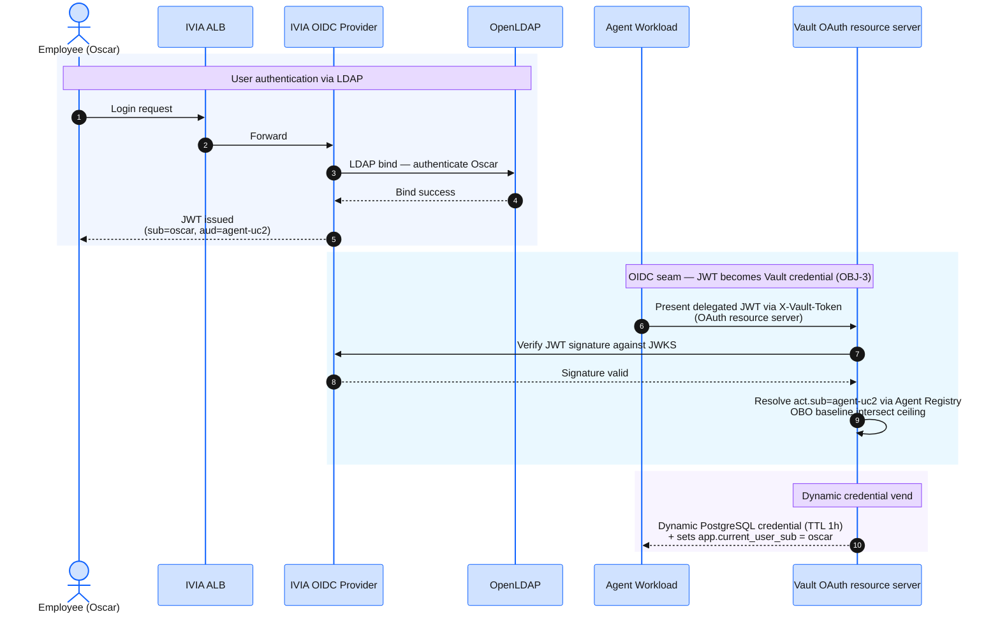

The OIDC seam is where an IVIA-issued JWT becomes a Vault-vended dynamic credential. `deploy-workshop.sh` already configured Vault's **OAuth resource server** profile to trust IVIA — confirm the wiring is correct before running use cases.

:::alert{header="No jwt auth backend" type="info"}
Vault Enterprise validates the IVIA token *directly*, as a resource server: the agent presents the OAuth JWT in `X-Vault-Token` and Vault checks it against the `ivia` profile. There is no `vault write auth/jwt/login`, and no `jwt/` auth mount — that backend was retired when the workshop moved to the native Agent Registry model. Step 1 below confirms it is gone.
:::

## The OIDC Seam at Runtime



The `sub` claim from the JWT flows through Vault into the Postgres session variable that activates Row-Level Security — each user sees only their own data, enforced at the database layer.

Load the root token before running the checks below:

```bash
export VAULT_ROOT_TOKEN=$(jq -r '.root_token' ~/vault-init.json)
```

## Step 1 — Confirm Vault auth methods

```bash
kubectl exec -n vault vault-0 -- \
  sh -c "VAULT_TOKEN='${VAULT_ROOT_TOKEN}' vault auth list"
```

Expected — exactly two mounts. `kubernetes/` is how Use Case 1's agent pod authenticates by service account; `token/` is Vault's built-in. **There is deliberately no `jwt/` row** — if you see one, the native cutover did not complete on your deploy:

```
Path           Type          Accessor                    Description                Version
----           ----          --------                    -----------                -------
kubernetes/    kubernetes    auth_kubernetes_1f629075    n/a                        n/a
token/         token         auth_token_78018ae6         token based credentials    n/a
```

## Step 2 — Confirm secrets engines

```bash
kubectl exec -n vault vault-0 -- \
  sh -c "VAULT_TOKEN='${VAULT_ROOT_TOKEN}' vault secrets list"
```

Expected — six mounts. `agent-registry/` is the Enterprise engine that holds the agent identities (you listed its three registrations on the [Validate Vault](../35-verify-vault/) page); `database/` vends the per-request PostgreSQL credentials; `aws/` the dynamic IAM ones:

```
Path               Type              Accessor                   Description
----               ----              --------                   -----------
agent-registry/    agent_registry    agent-registry_0f95efab    agent registry
aws/               aws               aws_f9d9c477               n/a
cubbyhole/         cubbyhole         cubbyhole_8897d1f9         per-token private secret storage
database/          database          database_f6e29cda          n/a
identity/          identity          identity_425781cf          identity store
sys/               system            system_0f6fda79            system endpoints used for control, policy and debugging
```

## Step 3 — Confirm the OAuth resource server trusts IVIA

Vault Enterprise validates the IVIA-issued OAuth JWT directly through its **OAuth resource server** profile (`ivia`) — there is no `jwt` auth backend to configure. Read the profile:

```bash
kubectl exec -n vault vault-0 -- \
  sh -c "VAULT_TOKEN='${VAULT_ROOT_TOKEN}' vault read sys/config/oauth-resource-server/ivia" | grep -E 'issuer_id|enabled|audiences'
```

Expected — `enabled` is `true`; `issuer_id` matches the `iss` claim IVIA stamps on its tokens (the public WRP host = the nip.io FQDN from `infrastructure/.acme-state`); `audiences` lists the registered agent actors:

```
audiences    [uc3-actor agent-uc2]
enabled      true
issuer_id    https://<NIP_FQDN_WRP from infrastructure/.acme-state>
```

Vault validates IVIA-issued JWTs against the IVIA JWKS (the signing CA is pinned in the profile's `jwks_ca_pem`). `issuer_id` matches the `iss` claim IVIA stamps on its tokens (the WRP host attendees navigate to in their browser — `NIP_FQDN_WRP` in `infrastructure/.acme-state`). The exact value is per-deploy and is not captured live in this doc; resolve it locally with `grep NIP_FQDN_WRP infrastructure/.acme-state`.

## Step 4 — Confirm database connection

```bash
kubectl exec -n vault vault-0 -- \
  sh -c "VAULT_TOKEN='${VAULT_ROOT_TOKEN}' vault read database/config/workshop-pg"
```

Expected — `allowed_roles` lists the four use case roles (Use Case 3 has two: a writer for the refund and a reader):

```
Key                                   Value
---                                   -----
allowed_roles                         [uc1-readonly uc2-personal-readonly uc3-refund-writer uc3-readonly]
connection_details                    map[connection_url:postgresql://{{username}}:{{password}}@<rds-endpoint>:5432/workshop?sslmode=require ... username:vault_root]
plugin_name                           postgresql-database-plugin
```

## Step 5 — Confirm IVIA OIDC discovery (cluster-internal)

`--quiet` and `</dev/null` are both required — without them `kubectl run`'s `pod "oidc-check" deleted` message lands in the `jq` pipe and the command fails with a parse error:

```bash
kubectl run oidc-check --image=curlimages/curl --rm -i --restart=Never --quiet \
  -n verify-access -- \
  curl -sk https://iviaop.verify-access.svc.cluster.local:8436/oauth2/.well-known/openid-configuration \
  </dev/null | jq '{issuer, authorization_endpoint, token_endpoint, jwks_uri}'
```

Expected — the `issuer` is the **public WRP host**, the same value Step 3 showed in `issuer_id`, even though you reached the provider over its in-cluster ClusterIP. That single advertised issuer is what lets Vault validate every IVIA token against one `issuer_id`:

```json
{
  "issuer": "https://<NIP_FQDN_WRP>",
  "authorization_endpoint": "https://<NIP_FQDN_WRP>/isvaop/oauth2/authorize",
  "token_endpoint": "https://<NIP_FQDN_WRP>/isvaop/oauth2/token",
  "jwks_uri": "https://<NIP_FQDN_WRP>/isvaop/oauth2/jwks"
}
```

:::expand{header="Platform Track — Why declarative IVIA configuration?"}

The `iviaop` image reads its entire configuration from a `config.yaml` file mounted as a ConfigMap. This is different from the full ISVA appliance, which exposes a management REST API.

Advantages:

1. **GitOps-friendly** — the full OIDC provider configuration is visible in Terraform HCL, version-controlled, and reviewable.
2. **Idempotent** — redeploying the pod picks up config changes. No drift between what the API was told and what the pod is running.
3. **No bootstrap ordering** — clients, LDAP connections, and attribute mappings are all available at first startup.

The `ivia-configure.sh` script is verification-only — it confirms OIDC discovery is responding and the ALB has an address. It does not modify IVIA state.
:::
