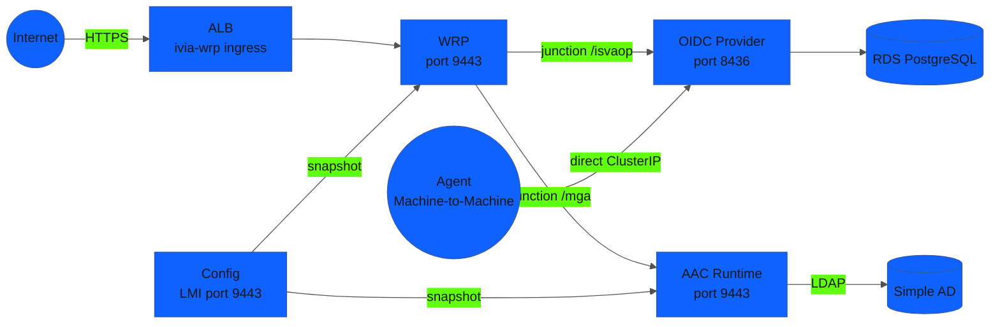

## Overview

IBM Verify Identity Access (IVIA) runs as a **four-container architecture** on EKS:

| Container | Image | Role |
|-----------|-------|------|
| Config (`ivia-config`) | `icr.io/ivia/ivia-config:11.0.2.0` | Local Management Interface (LMI), publishes configuration snapshots |
| Web Reverse Proxy (`ivia-wrp`) | `icr.io/ivia/ivia-wrp:11.0.2.0` | Browser entry point, junction routing, session management |
| AAC Runtime (`ivia-runtime`) | `icr.io/ivia/ivia-runtime:11.0.2.0` | Advanced Access Control authentication engine |
| OIDC Provider (`ivia-oidc-provider`) | `icr.io/ivia/ivia-oidc-provider:25.10` | OAuth 2.0 token issuance, JWKS, CIBA, mapping rules |

**Traffic routing:** The WRP is the single internet-facing entry point for all browser-based flows (CIBA consent, authorization_code login). Machine-to-machine flows (CIBA bc-authorize, token exchange, ROPC) bypass WRP and hit the OIDC Provider directly via its internal ClusterIP service.

## Architecture



## Why the Full Stack?

:::collapsible{header="Why the standalone OIDC Provider was insufficient"}
The standalone `ivia-oidc-provider` is a token factory. It issues OAuth tokens, hosts JWKS endpoints, and executes JavaScript mapping rules. But it has **no authentication engine**.

When a flow requires user interaction — CIBA consent or authorization_code login — the OIDC Provider returns `404` because it expects the Web Reverse Proxy to handle those browser sessions. The WRP is IVIA's point-of-contact for all browser-based flows.

Specifically, the standalone OIDC Provider cannot:
- Serve the `/oauth2/ciba_user_authorize/{id}` consent page (returns 404 without WRP)
- Display a login page (no HTML renderer)
- Validate credentials against Simple AD (no AAC engine)

This means Use Case 3's CIBA consent flow **cannot complete** without the full IVIA stack.
:::

## Deployment Sequence

The `depends_on` chain enforces this exact startup order:

1. **Config container (`ivia-config`) starts** — LMI available on ClusterIP port 9443. All other containers depend on Config being ready before they can pull configuration snapshots.

2. **Autoconf Job runs** — uploads the trial certificate to activate all modules (wga, mga, federation), creates a WRP instance, configures the `/isvaop` junction to the OIDC Provider, sets the `anyauth` ACL on the CIBA consent path, and publishes the configuration snapshot.

3. **Runtime (`ivia-runtime`) and WRP (`ivia-wrp`) start in parallel** — both download the published snapshot from Config via `CONFIG_SERVICE_URL`. WRP's ALB Ingress replaces the old OIDC Provider ALB as the external entry point.

## What Terraform Deploys

The `verify_access` module creates:

- Config container (`ivia-config:11.0.2.0`) — Deployment, ClusterIP Service, PersistentVolumeClaim
- Autoconf Kubernetes Job (`python:3.12-slim`) — activates modules, creates WRP instance and junctions
- AAC Runtime (`ivia-runtime:11.0.2.0`) — Deployment, ClusterIP Service
- Web Reverse Proxy (`ivia-wrp:11.0.2.0`) — Deployment, ClusterIP Service, ALB Ingress (internet-facing)
- OIDC Provider (`ivia-oidc-provider:25.10`) — existing deployment, now accessible via WRP `/isvaop` junction and directly at ClusterIP for machine-to-machine flows
- ICR pull secret (`icr-pull-secret`) for all four containers
- RDS PostgreSQL schema (OIDC Provider bootstrap)

## Step 1 — Verify all pods are running

The `verify_access` module was deployed as part of the foundation `terraform apply` in the previous module. No separate apply step is needed. Verify the four pods are healthy:

```bash
kubectl get pods -n verify-access
```

Expected output — four pods Running:

```
NAME                             READY   STATUS    RESTARTS   AGE
ivia-config-<hash>               1/1     Running   0          10m
ivia-runtime-<hash>              1/1     Running   0          8m
ivia-wrp-<hash>                  1/1     Running   0          8m
isvaop-deployment-<hash>         1/1     Running   0          12m
```

:::alert{header="Config must start first" type="warning"}
If `ivia-runtime` or `ivia-wrp` pods fail to start with `CrashLoopBackOff`, check whether `ivia-config` is Running. Runtime and WRP cannot download their configuration snapshot until Config's LMI is available. The autoconf Job also requires Config to be ready before it can publish the initial snapshot.
:::

## Step 2 — Check the WRP ALB Ingress

```bash
kubectl get ingress -n verify-access
```

Expected output:

```
NAME       CLASS   HOSTS   ADDRESS                                        PORTS   AGE
ivia-wrp   alb     *       k8s-verifyac-ivia-xxxx.elb.amazonaws.com      80      8m
```

The WRP ALB hostname is the external entry point for all browser flows. Save it:

```bash
WRP_HOST=$(kubectl get ingress -n verify-access ivia-wrp \
  -o jsonpath='{.status.loadBalancer.ingress[0].hostname}')
echo "WRP host: $WRP_HOST"
```

## Step 3 — Verify OIDC discovery via WRP junction

The OIDC Provider is accessible externally via the WRP `/isvaop` junction:

```bash
curl -s "http://$WRP_HOST/isvaop/oauth2/.well-known/openid-configuration" | jq .issuer
```

Expected:

```
"http://<wrp-alb-hostname>/isvaop"
```

Vault's JWT auth method uses the **internal ClusterIP** URL (not the WRP ALB) as `bound_issuer`:

```bash
kubectl run oidc-check --image=curlimages/curl --rm -i --restart=Never \
  -n verify-access -- \
  curl -sk https://isvaop.verify-access.svc.cluster.local:8436/oauth2/.well-known/openid-configuration \
  | jq .issuer
```

Expected:

```
"https://isvaop.verify-access.svc.cluster.local:8436/oauth2"
```

:::collapsible{header="Why raw Kubernetes manifests instead of Helm?"}
IBM Verify Identity Access does not publish a Helm chart. The `verify_access` Terraform module uses the `kubernetes` provider to manage each Kubernetes resource as a Terraform resource (`kubernetes_namespace`, `kubernetes_secret`, `kubernetes_deployment`, `kubernetes_service`, `kubernetes_ingress_v1`).

Using the `kubernetes` provider (rather than `kubectl_manifest` with raw YAML) keeps the full configuration visible as Terraform HCL. Attendees can read the exact Deployment spec, resource requests, environment variables, and volume mounts directly in `infrastructure/modules/verify_access/main.tf`. The four image tags in use are:
- `icr.io/ivia/ivia-config:11.0.2.0`
- `icr.io/ivia/ivia-runtime:11.0.2.0`
- `icr.io/ivia/ivia-wrp:11.0.2.0`
- `icr.io/ivia/ivia-oidc-provider:25.10`
:::
