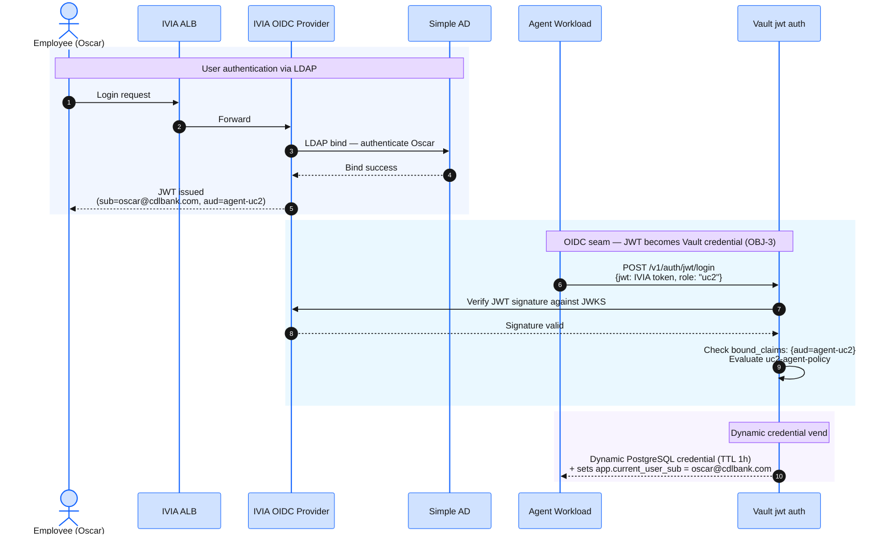

## Overview

In this step you configure the **OIDC seam** — the integration point where an IVIA-issued JWT becomes a Vault-vended dynamic credential. This involves two parts:

1. **Vault configuration** (via `configure-workshop.sh` → `vault-configure.sh`) — wires up Vault auth methods, secrets engines, and policies.
2. **IVIA verification** (via `configure-workshop.sh` → `ivia-configure.sh`) — confirms IVIA's OIDC discovery and OAuth clients are serving correctly. IVIA itself is configured **declaratively** — the `verify_access` Terraform module embeds the full OIDC provider configuration (clients, LDAP, grant types) in `config.yaml` at deploy time. No post-deploy REST API calls are needed.

After this step, Vault trusts IVIA-issued JWTs, and IVIA authenticates users against AWS Simple AD via LDAP.

## What gets configured

### Vault (via vault-configure.sh)

- **Kubernetes auth method** — enables workloads with projected service-account tokens to authenticate as Vault entities.
- **JWT auth method** — trusts IVIA's OIDC discovery URL; binds user-scoped JWT claims to Vault policies.
- **Database secrets engine** — dynamic PostgreSQL credentials with three roles (read-only, read-write, audit).
- **AWS secrets engine** — dynamic IAM credentials for agents that need AWS API access.
- **Vault policies** — `uc1-agent-policy`, `uc2-agent-policy`, `uc3-agent-policy` scoped to each use case.
- **Audit device** — file-based audit log writing to `/vault/audit/vault-audit.log` inside the pod (mapped to a PVC, read by a log-shipper sidecar).

### IVIA (declarative — deployed with verify_access module)

IVIA's OIDC provider (`isvaop`) is configured entirely via `config.yaml` embedded in the Terraform `verify_access` module. The configuration includes:

- **OAuth 2.0 clients** — `agent-uc2` (authorization code + PKCE, public client) and `workshop_agent` (confidential client for CIBA flows).
- **LDAP server connection** — authenticates users against AWS Simple AD on port 389, with bind credentials from a Kubernetes Secret.
- **User attribute mapping** — maps LDAP attributes (`mail`, `cn`, `uid`) to JWT claims (`sub`, `name`, `email`).
- **Grant types** — `authorization_code` + `refresh_token` for Use Case 2; CIBA for Use Case 3.

No `isva_config` REST API module is needed — `isvaop` reads its configuration at startup from the ConfigMap.

## Step 1 — VAULT_TOKEN and VAULT_ADDR

The `vault-configure.sh` script needs the Vault root token and address. These are handled automatically by `configure-workshop.sh` — the `vault-init.sh` step initializes Vault and writes the root token to `~/vault-init.json`, and subsequent steps read from that file. No manual variable setup is needed.

## Step 2 — Run configure-workshop.sh

After `vault` and `verify_access` are healthy (verified in the previous steps), run the post-deploy configuration script:

```bash
bash infrastructure/scripts/configure-workshop.sh
```

This script runs five steps:

1. **vault-init.sh** — initializes and unseals Vault (idempotent — skips if already initialized).
2. **vault-configure.sh** — wires up Vault auth methods, secrets engines, and policies.
3. **ivia-configure.sh** — verifies IVIA is serving OIDC discovery and has the expected clients.
4. **create-simple-ad-users.sh** — provisions Oscar and Adriana in AWS Simple AD (idempotent — skips if users exist).
5. **seed-banking-db.sh** — seeds the banking database with test data for Use Case 2.

## Step 3 — Verify Vault auth methods

```bash
kubectl exec -n vault vault-0 -- vault auth list
```

Expected output:

```
Path           Type          Accessor                Description
----           ----          --------                -----------
kubernetes/    kubernetes    auth_kubernetes_...     Kubernetes workload auth
jwt/           jwt           auth_jwt_...            IVIA OIDC user auth
token/         token         auth_token_...          token based credentials
```

Verify secrets engines:

```bash
kubectl exec -n vault vault-0 -- vault secrets list
```

Expected output:

```
Path          Type         Description
----          ----         -----------
aws/          aws          Dynamic IAM credentials
database/     database     Dynamic PostgreSQL credentials
sys/          system       system endpoints used for control, policy and debugging
```

## Step 4 — Verify the JWT auth points to IVIA

```bash
kubectl exec -n vault vault-0 -- vault read auth/jwt/config
```

Expected output includes:

```
oidc_discovery_url    https://isvaop.verify-access.svc.cluster.local:8436/oauth2
bound_issuer          https://isvaop.verify-access.svc.cluster.local:8436/oauth2
```

## Step 5 — Verify the database connection

```bash
kubectl exec -n vault vault-0 -- vault read database/config/workshop-pg
```

Expected output shows the PostgreSQL connection URL. The `allowed_roles` field lists the three roles:

```
connection_details    map[username:vault_root ...]
allowed_roles         uc1-readonly, uc2-readwrite, uc3-audit
```

## Step 6 — Verify IVIA OIDC discovery

From within the cluster, confirm IVIA is serving the OIDC discovery document:

```bash
kubectl run oidc-check --image=curlimages/curl --rm -i --restart=Never \
  -n verify-access -- \
  curl -sk https://isvaop.verify-access.svc.cluster.local:8436/oauth2/.well-known/openid-configuration \
  | jq .
```

Expected output includes:

```json
{
  "issuer": "https://isvaop.verify-access.svc.cluster.local:8436/oauth2",
  "authorization_endpoint": "https://isvaop.verify-access.svc.cluster.local:8436/oauth2/authorize",
  "token_endpoint": "https://isvaop.verify-access.svc.cluster.local:8436/oauth2/token",
  "jwks_uri": "https://isvaop.verify-access.svc.cluster.local:8436/oauth2/jwks",
  ...
}
```

## What was configured — summary

| Source | Resource | Count |
|---|---|---|
| vault-configure.sh | Kubernetes auth method | 1 |
| vault-configure.sh | JWT auth method (IVIA OIDC) | 1 |
| vault-configure.sh | Database secrets engine | 1 |
| vault-configure.sh | Database roles | 3 (uc1-readonly, uc2-readwrite, uc3-audit) |
| vault-configure.sh | AWS secrets engine | 1 |
| vault-configure.sh | Vault policies | 3 (uc1/uc2/uc3) |
| vault-configure.sh | Audit device | 1 (file, PVC) |
| verify_access config.yaml | OAuth 2.0 clients | 2 (agent-uc2, workshop_agent) |
| verify_access config.yaml | LDAP server connection | 1 (Simple AD) |
| verify_access config.yaml | User attribute mappings | 3 (sub, email, name) |
| create-simple-ad-users.sh | AD user accounts | 2 (Oscar, Adriana) |

## The OIDC seam — how it works at runtime



The `sub` claim from the JWT flows through Vault into the Postgres session variable that activates Row-Level Security — each user sees only their own data, enforced at the database layer.

:::expand{header="Platform Track — Why declarative IVIA configuration?"}

The `isvaop` image (IBM Verify Identity Access OIDC Provider) reads its entire configuration from a `config.yaml` file mounted as a ConfigMap. This is different from the full ISVA appliance, which exposes a management REST API (`/mga/sps/...`).

Advantages of the declarative approach:

1. **GitOps-friendly** — the full OIDC provider configuration is visible in Terraform HCL, version-controlled, and reviewable.
2. **Idempotent** — redeploying the pod picks up any config changes. No drift between what the API was told and what the pod is running.
3. **No bootstrap ordering** — clients, LDAP connections, and attribute mappings are all available at first startup. No need to wait for the pod to be healthy before running configuration scripts.

The `ivia-configure.sh` script is verification-only — it confirms OIDC discovery is responding and the ALB has an address. It does not modify IVIA state.
:::
