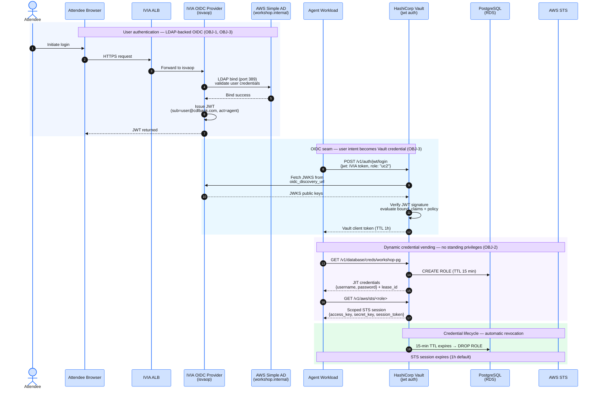

## Overview

This module deploys the credential-vending backbone and identity provider that all three use cases depend on:

- **HashiCorp Vault 2.0** — 3-node Raft HA cluster (one pod per Availability Zone), auto-unsealed by a dedicated AWS KMS key, with audit events written to stdout in JSON format.
- **IBM Verify Identity Access (IVIA) 11.0.2** — self-hosted OIDC provider and CIBA authorization server, deployed as Kubernetes workloads on the same EKS cluster, fronted by an AWS Application Load Balancer via AWS Load Balancer Controller.

After deployment and configuration, the Vault `jwt` auth method trusts IVIA's OIDC discovery URL. This is the **single seam where user intent becomes a Vault-vended credential** — the architectural keystone all three use cases build on. When an agent presents an IVIA-issued JWT to Vault, Vault resolves the user's identity from the JWT claims, evaluates the bound policy, and vends a short-lived dynamic credential scoped to exactly what the user authorized.

## Sub-modules

1. [Deploy Vault](./41-deploy-vault/) — provision the Vault Raft HA cluster, KMS unseal key, and Pod Identity association.
2. [Deploy Verify Access](./42-deploy-verify-access/) — provision IBM IVIA 11.0.2 with LDAP authentication against AWS Simple AD, and ALB Ingress.
3. [Configure the OIDC Seam](./43-configure-oidc-seam/) — wire Vault `kubernetes` and `jwt` auth methods, dynamic Postgres/AWS secrets engines, and provision workshop users in Simple AD.
4. [Verify Platform](./44-verify-platform/) — run the platform verification script confirming Vault seal status, Raft peer count, IVIA health, and OIDC discovery reachability.

## Architecture reference



The Vault `jwt` auth method is configured with IVIA's OIDC discovery URL as the `oidc_discovery_url`. Every JWT Vault receives from an agent is verified against IVIA's JWKS endpoint, making IVIA the authoritative identity plane for all user-delegated operations. IVIA authenticates users against AWS Simple AD via LDAP — in a real enterprise, this would be your organization's existing Active Directory.

## Key concepts

**Credential-vending backbone** — Vault stores no long-lived credentials for the workshop's data plane. Every credential (PostgreSQL password, AWS STS token) is generated on-demand with a TTL, tied to the requesting entity, and written to the Vault audit log. This satisfies OBJ-2 (no standing privileges) and OBJ-4 (enforcement at point of use).

**User-intent binding** — IVIA authenticates employees from your organization's Active Directory (AWS Simple AD in this workshop) and issues JWTs that carry both the authenticated user identity (`sub`) and the agent identity (`act` / `may_act`). Vault's JWT auth role `bound_claims` enforces that an agent can only request credentials that the bound user authorized via the CIBA flow. This satisfies OBJ-3 (actions tied to user intent).

**Correlated audit evidence** — Vault writes a structured JSON audit event for every credential vend. The event carries the JWT's `sub` and `act` claims, the requested path, and the outcome. Combined with IVIA's decision log and the agent's OTel trace, a single Athena query can reconstruct "who authorized what, when, for whom" across all three planes. This satisfies OBJ-5 (correlated audit evidence).

## Estimated deployment time

| Component | Approximate time |
|---|---|
| `vault` (Helm + KMS) | 4–6 minutes |
| `verify_access` (IVIA + Simple AD + ALB) | 6–10 minutes |
| `vault_config` + post-deploy scripts | 2–3 minutes |
| **Total** | **~15 minutes** |

Times vary based on EKS node capacity and ALB provisioning latency.

## Before you begin

Confirm the EKS cluster and foundation infrastructure are healthy:

```bash
kubectl get nodes
```

All three nodes should be in `Ready` state. If any nodes are `NotReady`, revisit the foundation phase before continuing.

The `icr_entitlement_key` is set in the HCP Terraform variable set during bootstrap. If the IVIA pod shows `ImagePullBackOff`, verify the key is correct in the HCP UI.
