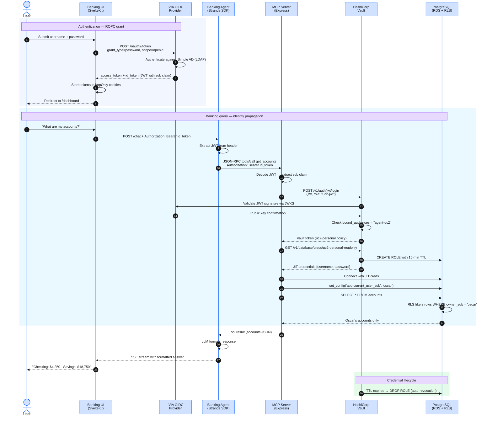

## Overview

In this module you open the Banking UI, sign in with your LDAP credentials, and observe how the ROPC (Resource Owner Password Credentials) grant delivers a JWT to the SvelteKit server. You will see how the JWT carries the `sub` claim that Vault's `jwt` auth method validates and that PostgreSQL Row-Level Security uses to filter rows.

## IVIA OIDC Provider — Authorization Only

IBM Verify Identity Access (IVIA) OIDC Provider is an **authorization** service, not an **authentication** UI. It issues tokens and validates policies but does not render a login form. In a production deployment, an external identity proxy such as WebSEAL presents the login form, the user authenticates, and IVIA issues tokens via the Authorization Code flow.

For this workshop, WebSEAL is not deployed. Instead, the Banking UI hosts its own login form and uses the **ROPC grant** (`grant_type=password`) — the canonical IBM pattern validated by the `ibm-verify-login` reference implementation. The user's credentials are posted directly to IVIA's token endpoint; IVIA authenticates the user against the Simple AD directory (LDAP) and returns an `access_token` and `id_token`.

:::alert{header="ROPC and production security" type="warning"}
The ROPC grant transmits user credentials directly to the authorization server. It requires a confidential client (the Banking UI sends its `client_secret` in the POST body). In production, the Authorization Code + PKCE flow is preferred — it moves credential handling entirely to the identity provider and eliminates the application as a credential intermediary. PKCE functions are retained in `auth.ts` as the upgrade path when WebSEAL or an external IdP is available.
:::

## Request Flow



**Step-by-step breakdown:**

1. The user submits credentials on the Banking UI login form. The SvelteKit server-side action calls IVIA's token endpoint with the ROPC grant.
2. IVIA authenticates against Simple AD, runs the `ropc` and `pretoken` mapping rules, and returns an access token + ID token (JWT with `sub` claim).
3. The Banking UI stores tokens in httpOnly cookies and redirects to the dashboard.
4. When the user asks a banking question, the UI's server-side proxy reads the `id_token` cookie and forwards it to the Banking Agent as a Bearer token.
5. The Banking Agent forwards the JWT unchanged to the MCP Server for each tool invocation.
6. The MCP Server presents the JWT to Vault's `jwt` auth method. Vault validates the signature against IVIA's JWKS endpoint and checks the `bound_audiences` claim (`agent-uc2`).
7. Vault issues a short-lived token bound to the `uc2-personal` policy.
8. The MCP Server uses that token to call `database/creds/uc2-personal-readonly`. Vault issues a JIT Postgres credential with a 15-minute TTL.
9. The MCP Server opens a Postgres connection, sets `app.current_user_sub` to the JWT's `sub` claim, and executes `SELECT` queries. PostgreSQL Row-Level Security filters results to the authenticated user's rows only.
10. The credential expires at TTL; Vault revokes the Postgres role automatically.

The `sub` claim in the `id_token` (e.g. `oscar`) flows to:

1. The **Banking UI** — identifies the logged-in user for display.
2. The **Strands agent** — forwarded in the `Authorization: Bearer` header to the MCP server.
3. **Vault jwt auth** — the MCP server exchanges the JWT for a Vault token scoped to the `uc2-jwt` role.
4. **PostgreSQL RLS** — the `app.current_user_sub` session variable is set from `sub`; the RLS policy filters `banking.accounts` rows to the authenticated user.

## Step 1 — Get the Banking UI URL

Retrieve the ALB hostname for the banking-ui Ingress:

```bash
kubectl get ingress -n banking-app banking-ui-ingress \
  -o jsonpath='{.status.loadBalancer.ingress[0].hostname}'
```

Open the URL in a browser:

```
http://<ALB_HOSTNAME>/
```

:::alert{header="HTTP only — lab environment" type="info"}
The ALB uses HTTP (not HTTPS) because ALB-generated hostnames cannot be registered in Route 53 for ACM certificate issuance. In a production deployment, use HTTPS with a custom domain and `secure: true` cookie flags.
:::

## Step 2 — Sign in as Oscar

On the Banking UI landing page you will see a login form with **Username** and **Password** fields. Enter the pre-created test user credentials:

- **Username:** `oscar`
- **Password:** `Workshop2026!`

Click **Sign in with IBM Verify**. The form POSTs to the `/login` SvelteKit action, which calls `passwordGrant()` against IVIA and sets an `httpOnly` `access_token` cookie. The browser is redirected to `/dashboard`.

:::alert{header="Where do these users come from?" type="info"}
Your organization uses Active Directory for employee identity management. This workshop uses AWS Simple AD — a lightweight managed directory — with two pre-provisioned employees (Oscar and Adriana). IVIA authenticates them via LDAP and issues JWTs that the MCP Server uses to obtain user-scoped database credentials from Vault.
:::

## Step 3 — Inspect the Banking UI logs

The Banking UI logs the ROPC login outcome. View the logs:

```bash
kubectl logs -n banking-app -l app=banking-ui --tail=30
```

Look for a log line that confirms the access_token was received and the cookie was set. Note that no credentials appear in logs — only the outcome.

## Step 4 — Confirm personalized dashboard data

After login, the dashboard shows Oscar's accounts and transactions. Observe:

- The balance figures are specific to Oscar — RLS is filtering the `banking.accounts` table by `sub = 'oscar'`.
- The agent responds to natural-language queries about Oscar's financial data.

## Step 5 — Switch users: sign in as Adriana

Log out (click **Logout** in the top-right corner), then sign in as:

- **Username:** `adriana`
- **Password:** `Workshop2026!`

The dashboard now shows Adriana's accounts and transactions — not Oscar's. The `sub` claim changed, activating a different RLS filter in PostgreSQL.

:::expand{header="Platform Track — IVIA OAuth client configuration for ROPC"}

The IVIA `agent-uc2` client is provisioned by the `verify_access` Terraform module with these settings:

| Setting | Value | Why |
|---|---|---|
| `client_id` | `agent-uc2` | Matches Vault jwt role `bound_audiences` |
| `client_secret` | `<generated>` | Required for ROPC — confidential client |
| `grant_types` | `authorization_code`, `refresh_token`, `password` | ROPC active; authorization_code retained for PKCE upgrade |
| `token_endpoint_auth_method` | `client_secret_post` | Secret sent in POST body (ROPC pattern) |
| `redirect_uris` | `http://<UI_ALB>/callback` | Retained for PKCE upgrade path |
| `scopes` | `openid`, `profile`, `email` | JWT carries sub, email, name claims |

The token endpoint call the Banking UI makes:

```
POST http://<IVIA_ALB>/oauth2/token
Content-Type: application/x-www-form-urlencoded

grant_type=password
&client_id=agent-uc2
&client_secret=<secret>
&username=oscar
&password=Workshop2026!
&scope=openid+profile+email
```

The `client_secret` is injected into the Banking UI pod via the `banking-ui-config` ConfigMap, populated from the `verify_access` Terraform module output at deploy time.

How the Banking UI maps to the SvelteKit file structure:

```
src/routes/
  +page.svelte          — Landing page with login form (action="/login")
  +page.server.ts       — Load: reads ?error= param, redirects if authenticated
  login/
    +page.server.ts     — Action: calls passwordGrant(), sets httpOnly cookies
    +page.svelte        — Minimal page (route target for SvelteKit)
  dashboard/
    +page.svelte        — Personalized banking dashboard
  logout/
    +server.ts          — Clears session cookies
```
:::

:::expand{header="Agent Developer Track — JWT claims and how the agent uses them"}

The Banking Agent receives the user's JWT in the `Authorization: Bearer <token>` header of every API call from the Banking UI. The agent does **not** validate the JWT signature — that is Vault's responsibility. The agent treats the JWT as an opaque credential and forwards it to the MCP Server.

The MCP Server calls Vault's `jwt` auth endpoint:

```typescript
// vault-client.ts
async loginWithJwt(userJwt: string): Promise<string> {
  const response = await fetch(`${VAULT_ADDR}/v1/auth/jwt/login`, {
    method: 'POST',
    headers: { 'Content-Type': 'application/json' },
    body: JSON.stringify({ role: 'uc2-jwt', jwt: userJwt }),
  });
  const data = await response.json();
  if (!response.ok) {
    throw new Error(`Vault jwt login failed: ${data.errors?.join(', ')}`);
  }
  return data.auth.client_token;
}
```

Vault validates the JWT against IVIA's JWKS endpoint (fetched from the `oidc_discovery_url` configured in the jwt auth backend). Vault then maps the `sub` claim from the JWT to the Vault entity metadata — enabling per-user policy evaluation.

The `sub` claim value (e.g., `oscar`) is also passed directly to the Postgres session:

```typescript
// mcp-server tools handler
await client.query("SET app.current_user_sub = $1", [sub]);
const accounts = await client.query(
  "SELECT * FROM banking.accounts"  // RLS filters by app.current_user_sub
);
```

This is the complete chain: `sub` in JWT → Vault jwt login claim extraction → Postgres session variable → RLS predicate. Each link is visible in application code — no magic.
:::
