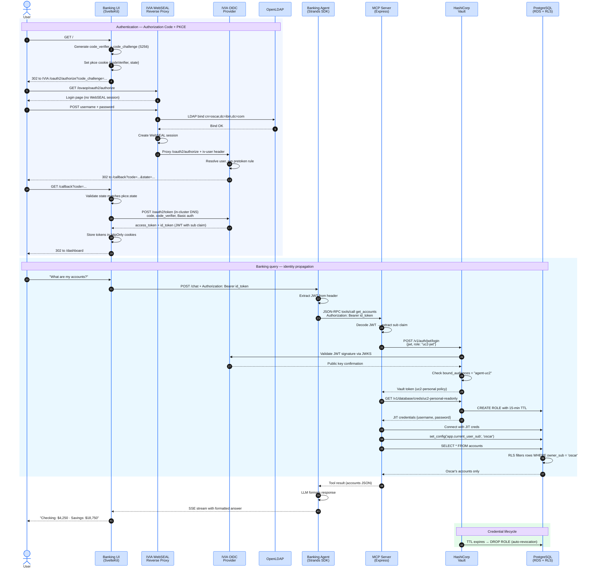

## Overview

In this module you open the Banking UI, sign in with your LDAP credentials at the IBM Verify Identity Access (IVIA) login page, and observe how the **OAuth Authorization Code + PKCE** flow delivers a JWT to the SvelteKit server. You will see how the JWT carries the `sub` claim that Vault's `jwt` auth method validates and that PostgreSQL Row-Level Security uses to filter rows.

## How the login is split between Banking UI and IVIA

IBM Verify Identity Access has two components in this deployment:

1. **IVIA OIDC Provider** (`iviaop` pod) — issues tokens, validates OAuth client credentials, runs the pre-token / post-token mapping rules. It does not render a login form.
2. **IVIA WebSEAL Reverse Proxy** (`iviawrprp1` pod) — sits in front of the OIDC Provider, renders the login form, performs LDAP bind against the user registry, and proxies authenticated traffic to the OIDC Provider with the user's identity attached as HTTP headers.

The Banking UI never displays a login form of its own. When an unauthenticated user lands on `/`, the SvelteKit server generates a PKCE verifier + challenge, sets a short-lived cookie, and 302s the browser to IVIA's `/oauth2/authorize` endpoint. The WebSEAL Reverse Proxy intercepts that request, serves its own HTML login form, validates the credentials against OpenLDAP, then proxies the (now authenticated) request to the OIDC Provider. The OIDC Provider issues a one-time authorization code and redirects the browser back to the Banking UI's `/callback` URL.

The Banking UI's `/callback` handler then exchanges the code for tokens server-to-server, directly against the OIDC Provider via the in-cluster Kubernetes Service URL — that exchange bypasses the WebSEAL Reverse Proxy entirely.

:::alert{header="Why PKCE for a server-side application?" type="info"}
PKCE protects against authorization code interception. Even though the Banking UI is a confidential client (it has a `client_secret`), PKCE is required by the IVIA `agent-uc2` client configuration (`require_pkce: true`). The PKCE pair (`code_verifier` + `code_challenge`) is generated server-side in `+page.server.ts`, persisted to a short-lived `pkce` httpOnly cookie, and verified by IVIA at the token exchange step.
:::

## Request Flow



**Step-by-step breakdown:**

1. The user opens the Banking UI URL. The SvelteKit server load on `/` sees no `access_token` cookie, generates a PKCE pair (`code_verifier` + `code_challenge` via S256), persists `codeVerifier` and CSRF `state` to a short-lived `pkce` cookie, and 302s the browser to IVIA `/oauth2/authorize` with the public `code_challenge` and `state`.
2. The WebSEAL Reverse Proxy intercepts the unauthenticated request to `/isvaop/oauth2/authorize` and serves its built-in login page.
3. The user submits username + password to WebSEAL. WebSEAL performs an LDAP bind against OpenLDAP (`cn=<user>,dc=ibm,dc=com`). On success, WebSEAL creates a session and proxies the authorize request to the OIDC Provider with the `iv-user` header carrying the authenticated identity.
4. The OIDC Provider runs the pre-token mapping rule, issues a one-time authorization code, and 302s the browser back to the Banking UI's `/callback?code=...&state=...`.
5. The Banking UI's `/callback` handler validates that the returned `state` matches the `pkce` cookie, then POSTs to the OIDC Provider's `/oauth2/token` endpoint over the in-cluster Kubernetes Service URL (`https://iviaop.verify-access.svc.cluster.local:8436`) — bypassing the WebSEAL ALB. The POST carries HTTP Basic auth (`agent-uc2:<client_secret>`) plus the `code` and `code_verifier`.
6. The OIDC Provider verifies the code, checks the PKCE proof against the original challenge, runs the post-token mapping rule, and returns an `access_token` plus `id_token` (JWTs with the `sub` claim).
7. The Banking UI stores the tokens in httpOnly cookies (`access_token`, `id_token`, optional `refresh_token`) and 302s the browser to `/dashboard`.
8. When the user asks a banking question, the UI's server-side proxy reads the `id_token` cookie and forwards it to the Banking Agent as a Bearer token.
9. The Banking Agent forwards the JWT unchanged to the MCP Server for each tool invocation.
10. The MCP Server presents the JWT to Vault's `jwt` auth method. Vault validates the signature against IVIA's JWKS endpoint and checks the `bound_audiences` claim (`agent-uc2`).
11. Vault issues a short-lived token bound to the `uc2-personal` policy.
12. The MCP Server uses that token to call `database/creds/uc2-personal-readonly`. Vault issues a JIT Postgres credential with a 15-minute TTL.
13. The MCP Server opens a Postgres connection, sets `app.current_user_sub` to the JWT's `sub` claim, and executes `SELECT` queries. PostgreSQL Row-Level Security filters results to the authenticated user's rows only.
14. The credential expires at TTL; Vault revokes the Postgres role automatically.

The `sub` claim in the `id_token` (e.g. `oscar`) flows to:

1. The **Banking UI** — identifies the logged-in user for display.
2. The **Strands agent** — forwarded in the `Authorization: Bearer` header to the MCP server.
3. **Vault jwt auth** — the MCP server exchanges the JWT for a Vault token scoped to the `uc2-jwt` role.
4. **PostgreSQL RLS** — the `app.current_user_sub` session variable is set from `sub`; the RLS policy filters `banking.accounts` rows to the authenticated user.

## Step 1 — Get the Banking UI URL

Retrieve the ALB hostname for the banking-ui Ingress:

```bash
kubectl get ingress -n banking-app banking-ui-ingress \
  -o jsonpath='{.status.loadBalancer.ingress[0].hostname}'
```

Open the URL in a browser:

```
http://<ALB_HOSTNAME>/
```

:::alert{header="HTTP only — lab environment" type="info"}
The ALB uses HTTP (not HTTPS) because ALB-generated hostnames cannot be registered in Route 53 for ACM certificate issuance. In a production deployment, use HTTPS with a custom domain and `secure: true` cookie flags.
:::

## Step 2 — Sign in at the IVIA login page

When you open the Banking UI URL, the browser is immediately redirected to the IVIA WebSEAL Reverse Proxy login page. You will not see a Banking UI login form — the entire credential entry happens on IVIA.

Enter the pre-created test user credentials:

- **Username:** `oscar`
- **Password:** `WorkshopUser1!`

Click **Login**. WebSEAL performs an LDAP bind against OpenLDAP and, on success, redirects you back through `/isvaop/oauth2/authorize` to the Banking UI's `/callback?code=...` URL. The Banking UI exchanges the code for an access token and lands you on `/dashboard`.

:::alert{header="Where do these users come from?" type="info"}
This workshop uses OpenLDAP as the user registry, with two pre-provisioned users (Oscar and Adriana) created by the `verify_access` Terraform module. WebSEAL authenticates them via LDAP bind. The IVIA OIDC Provider then issues JWTs that the MCP Server uses to obtain user-scoped database credentials from Vault.
:::

## Step 3 — Inspect the Banking UI logs

The Banking UI logs the OAuth code exchange outcome. View the logs:

```bash
kubectl logs -n banking-app -l app=banking-ui --tail=30
```

You will not see credentials in these logs — only the outcome of the token exchange. Credentials never reach the Banking UI; they are entered on the WebSEAL login page and validated by WebSEAL via LDAP bind.

## Step 4 — Confirm personalized dashboard data

After login, the dashboard shows Oscar's accounts and transactions. Observe:

- The balance figures are specific to Oscar — RLS is filtering the `banking.accounts` table by `sub = 'oscar'`.
- The agent responds to natural-language queries about Oscar's financial data.

## Step 5 — Switch users: sign in as Adriana

Log out (click **Logout** in the top-right corner), then open the Banking UI URL again. You will be sent back to the WebSEAL login page. Sign in as:

- **Username:** `adriana`
- **Password:** `WorkshopUser1!`

The dashboard now shows Adriana's accounts and transactions — not Oscar's. The `sub` claim changed, activating a different RLS filter in PostgreSQL.

:::expand{header="Platform Track — IVIA OAuth client configuration"}

The IVIA `agent-uc2` client is provisioned by the `verify_access` Terraform module with these settings (declared in `modules/verify_access/iviaop-config/clients.yml.tftpl`):

| Setting | Value | Why |
|---|---|---|
| `client_id` | `agent-uc2` | Matches Vault jwt role `bound_audiences` |
| `client_secret` | `<generated>` | Confidential client — sent via HTTP Basic on the token exchange |
| `grant_types` | `authorization_code`, `refresh_token` | Authorization Code flow with optional refresh |
| `response_types` | `code` | Authorization Code response type |
| `require_pkce` | `true` | PKCE proof required at token exchange |
| `token_endpoint_auth_method` | `client_secret_basic` | HTTP Basic auth on `/oauth2/token` |
| `redirect_uris` | `http://<UI_ALB>/callback` | Patched post-deploy with the real Banking UI ALB hostname |
| `scopes` | `openid`, `profile`, `email` | JWT carries sub, email, name claims |

The authorize URL the browser is redirected to:

```
http://<IVIA_ALB>/isvaop/oauth2/authorize
  ?response_type=code
  &client_id=agent-uc2
  &redirect_uri=http://<UI_ALB>/callback
  &code_challenge=<S256 hash of code_verifier>
  &code_challenge_method=S256
  &state=<CSRF token>
  &scope=openid+profile+email
```

The token exchange the Banking UI server makes (in-cluster, bypasses the ALB):

```
POST https://iviaop.verify-access.svc.cluster.local:8436/oauth2/token
Authorization: Basic base64(agent-uc2:<client_secret>)
Content-Type: application/x-www-form-urlencoded

grant_type=authorization_code
&code=<one-time code>
&redirect_uri=http://<UI_ALB>/callback
&code_verifier=<original PKCE verifier>
```

The `client_secret` is injected into the Banking UI pod via the `banking-ui-config` ConfigMap, populated from the `verify_access` Terraform module output at deploy time.

How the Banking UI maps to the SvelteKit file structure:

```
src/routes/
  +page.svelte          — Minimal fallback (server always 302s first)
  +page.server.ts       — Load: redirects authenticated users to /dashboard,
                          generates PKCE and 302s everyone else to IVIA
  callback/
    +page.server.ts     — Validates state, posts to /oauth2/token, sets cookies
  dashboard/
    +page.svelte        — Personalized banking dashboard
  logout/
    +server.ts          — Clears session cookies
src/lib/
  auth.ts               — Server-side PKCE helpers: generatePkce,
                          buildAuthorizeUrl, exchangeCodeForTokens
```
:::

:::expand{header="Agent Developer Track — JWT claims and how the agent uses them"}

The Banking Agent receives the user's JWT in the `Authorization: Bearer <token>` header of every API call from the Banking UI. The agent does **not** validate the JWT signature — that is Vault's responsibility. The agent treats the JWT as an opaque credential and forwards it to the MCP Server.

The MCP Server calls Vault's `jwt` auth endpoint:

```typescript
// vault-client.ts
async loginWithJwt(userJwt: string): Promise<string> {
  const response = await fetch(`${VAULT_ADDR}/v1/auth/jwt/login`, {
    method: 'POST',
    headers: { 'Content-Type': 'application/json' },
    body: JSON.stringify({ role: 'uc2-jwt', jwt: userJwt }),
  });
  const data = await response.json();
  if (!response.ok) {
    throw new Error(`Vault jwt login failed: ${data.errors?.join(', ')}`);
  }
  return data.auth.client_token;
}
```

Vault validates the JWT against IVIA's JWKS endpoint (fetched from the `oidc_discovery_url` configured in the jwt auth backend). Vault then maps the `sub` claim from the JWT to the Vault entity metadata — enabling per-user policy evaluation.

The `sub` claim value (e.g., `oscar`) is also passed directly to the Postgres session:

```typescript
// mcp-server tools handler
await client.query("SET app.current_user_sub = $1", [sub]);
const accounts = await client.query(
  "SELECT * FROM banking.accounts"  // RLS filters by app.current_user_sub
);
```

This is the complete chain: `sub` in JWT → Vault jwt login claim extraction → Postgres session variable → RLS predicate. Each link is visible in application code — no magic.
:::
