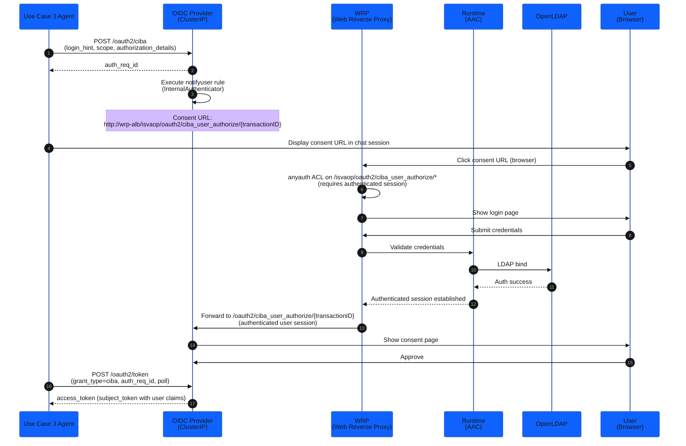

## How CIBA Works

CIBA (OpenID Connect Client-Initiated Backchannel Authentication) lets an automated agent request user approval without controlling the browser session. The agent initiates the flow on the backchannel; the user approves on a separate device.

## CIBA Consent Flow Through WRP



**Step-by-step:**

1. Agent POSTs to `/bc-authorize` with `login_hint=<user_sub>` and `binding_message=<request_id>` — the `binding_message` is what the user sees in the approval notification.
2. IVIA returns an `auth_req_id`. The agent stores this and begins polling.
3. IVIA executes the `notifyuser` mapping rule using an `InternalAuthenticator` — this calls `ciba.getUserAuthorizeEndpoint()` to obtain the consent URL (which embeds an internal `transactionID`) and pushes it to the banking-app backend via HTTP POST.
4. The agent displays the consent URL in the chat session. The user opens the URL in a browser.
5. The WRP requires authentication (anyauth ACL on `/isvaop/oauth2/ciba_user_authorize/*`). The user enters their credentials; WRP validates them against the in-cluster OpenLDAP directory via the AAC Runtime.
6. Once authenticated, WRP forwards the session to the OIDC Provider, which renders the consent page.
7. The user approves. Agent polls `/token` with `grant_type=urn:openid:params:grant-type:ciba` and the `auth_req_id` at 5-second intervals (up to 120 seconds).
8. After approval, IVIA returns an access token (`subject_token`) with the user's identity claims.

:::alert{header="Two separate paths" type="info"}
The CIBA **backchannel** (bc-authorize and token poll) is machine-to-machine — the agent calls the OIDC Provider ClusterIP directly, bypassing WRP. Only the **browser consent flow** (steps 4–6 above) goes through WRP. This separation is intentional: WRP handles human authentication; the OIDC Provider handles token issuance.
:::

## RFC 8693 Token Exchange

The CIBA access token proves the user approved, but it does not prove *which agent* is acting. Token Exchange (RFC 8693) produces a delegated JWT that carries both.

The Use Case 3 agent exchanges:
- `subject_token` = the CIBA-issued user access token (proves user identity)
- `actor_token` = the agent's own Kubernetes service account JWT (proves agent identity)

IVIA returns a delegated JWT containing:
- `sub` = the user (`oscar`)
- `may_act.sub` = the agent's service account identity (`service-account:agent-uc3`)
- `authorization_details` = `[{"type": "refund_approval", "amount": 50.00, "currency": "USD"}]`

The delegated JWT is what the agent presents to Vault. Vault's `bound_claims` enforce that **both** `may_act.sub` and `authorization_details[0].type` match before issuing any DB credentials.

:::expand{header="Platform Track — IVIA CIBA Configuration"}
The IVIA CIBA client (`agent-uc3`) is configured in the `isva_config` Terraform module:

- `grant_types`: `["urn:openid:params:grant-type:ciba", "urn:ietf:params:oauth:grant-type:token-exchange"]`
- `backchannel_user_code_parameter_supported`: `true` (binding_message enforcement)
- `token_endpoint_auth_method`: `client_secret_post`

The IVIA token exchange endpoint at `/token` accepts `actor_token_type=urn:ietf:params:oauth:token-type:jwt` (Kubernetes SA JWT) and `subject_token_type=urn:ietf:params:oauth:token-type:access_token`.

The `notifyuser` mapping rule uses `InternalAuthenticator` (not `ExternalAuthenticator`). `notifyuser` calls `ciba.getUserAuthorizeEndpoint()` to obtain the consent URL (an internal URL that embeds a `transactionID` distinct from the `auth_req_id`), then HTTP-POSTs `{auth_req_id, consent_url}` to the banking-app backend at `/api/ciba/pending`. The agent's `initiate_refund` tool reads it back by `auth_req_id` and surfaces the URL to the user.
:::

:::expand{header="Agent Dev Track — Polling Loop and Token Exchange Code"}
The Use Case 3 agent implements CIBA polling in `applications/uc3-agent/app/agent.py`:

```python
# Initiate CIBA (direct to OIDC Provider ClusterIP — bypasses WRP)
resp = requests.post(f"{IVIA_BASE}/bc-authorize", data={
    "client_id": CLIENT_ID,
    "client_secret": CLIENT_SECRET,
    "login_hint": user_sub,
    "binding_message": request_id,  # propagated as traceparent
    "scope": "openid",
})
auth_req_id = resp.json()["auth_req_id"]

# The notifyuser rule pushes the consent URL to /api/ciba/pending.
# The consent URL embeds an internal transactionID (not the auth_req_id).
# The agent reads it back by auth_req_id:
consent_url = ciba_store.get(auth_req_id)  # set by notifyuser push
print(f"Please approve the request at: {consent_url}")

# Poll until approved (5s interval, 120s timeout)
for _ in range(24):
    time.sleep(5)
    token_resp = requests.post(f"{IVIA_BASE}/token", data={
        "grant_type": "urn:openid:params:grant-type:ciba",
        "client_id": CLIENT_ID,
        "client_secret": CLIENT_SECRET,
        "auth_req_id": auth_req_id,
    })
    if token_resp.status_code == 200:
        subject_token = token_resp.json()["access_token"]
        break
```

`IVIA_BASE` points to the OIDC Provider ClusterIP (`https://isvaop.verify-access.svc.cluster.local:8436/oauth2`). The banking-app backend exposes `GET /api/ciba/pending/{auth_req_id}` to surface the consent URL to the agent.
:::

## Verification

Check CIBA + token exchange is working:

```bash
# Confirm Use Case 3 agent pod is running
kubectl get pods -n banking-app -l app=uc3-agent

# Tail agent logs to see CIBA polling output
kubectl logs -n banking-app -l app=uc3-agent --tail=50

# Confirm IVIA CIBA endpoint is reachable from vault pod (direct ClusterIP path)
kubectl exec -n vault vault-0 -- sh -c \
  "wget -q -O - --no-check-certificate \
  'https://isvaop.verify-access.svc.cluster.local:8436/oauth2/.well-known/openid-configuration'" \
  | jq '.backchannel_authentication_endpoint'
```

```bash
# Confirm WRP consent endpoint is accessible (browser path)
WRP_HOST=$(kubectl get ingress -n verify-access ivia-wrp \
  -o jsonpath='{.status.loadBalancer.ingress[0].hostname}')
echo "Consent URL pattern: http://$WRP_HOST/isvaop/oauth2/ciba_user_authorize/<transactionID>"
```
