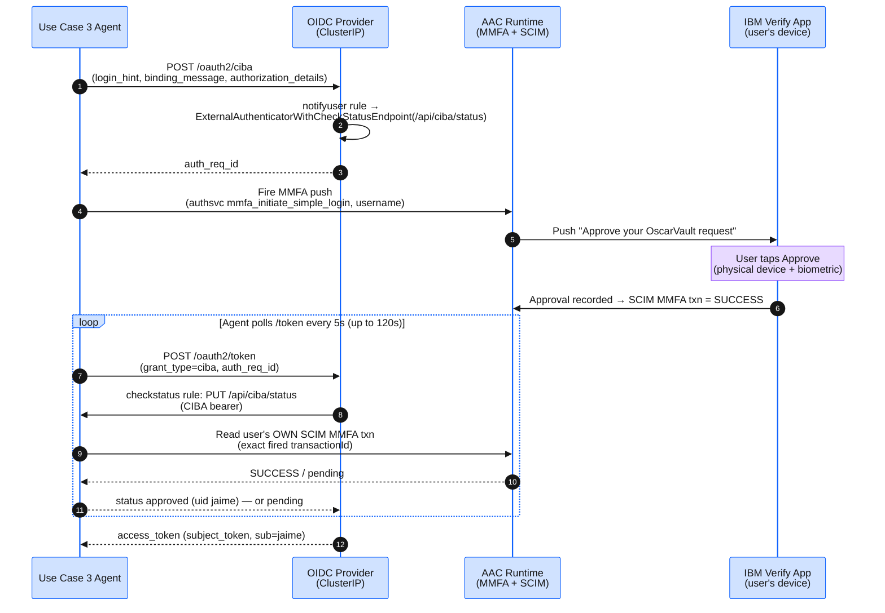

## Objective 3 · Actions tied to user intent

You ran the refund on the last page. This page is how it worked: the agent cannot open a browser for the customer, so it asks on a back channel and waits for an answer that arrives on a device it does not control.

## How the approval reaches a phone

**Why:** CIBA is what lets software ask a person for permission without driving their browser. The agent starts the flow; the human finishes it somewhere else entirely — here, a push that needs a physical tap.



:::alert{header="Why the approval is unforgeable" type="info"}
Two independent facts must both hold before the refund proceeds: the user physically taps **Approve** on their enrolled device, AND the agent confirms that the **exact** MMFA transaction it fired (matched by `transactionId`, never "any SUCCESS for the user") resolved to `SUCCESS` in that user's own SCIM record. The CIBA bearer is replayed to the check-status endpoint as a per-request shared secret — defense-in-depth on top of the SCIM gate. The backchannel (bc-authorize and token poll) is machine-to-machine and never touches the WRP.
:::

## Attaching the agent's identity

**Why:** The tap proves *who* said yes. It says nothing about *which software* is acting on it. This second exchange staples the agent's own name to the approval, so Vault can judge both.

The agent presents only the user's token, authenticated as a **separate** OAuth client (`uc3-actor`) via HTTP Basic — IVIA rejects a client exchanging its own token (`FBTAQ5207E`), so no `actor_token` is sent:
- `subject_token` = the CIBA-issued user access token (proves user identity + consent)

IVIA returns a delegated JWT containing:
- `sub` = the approving user (the human who completed the CIBA consent — e.g. `jaime`)
- `act.sub` = `uc3-actor` — injected server-side by the `isvaop_pretoken` mapping rule on the token-exchange grant (proves delegation)
- `authorization_details` = `[{"type": "refund_approval"}]` plus a `vault:path_access` RAR naming the target path — both stamped by `isvaop_pretoken`

The delegated JWT is what the agent presents to Vault via `X-Vault-Token`. Vault's OAuth resource server resolves `act.sub` (= `uc3-actor`) against the Agent Registry and narrows the token per request from its `vault:path_access` RAR before issuing any DB credentials.

:::alert{header="What the phone actually shows — and what binds the amount" type="warning"}
Be precise about what the tap on the phone proves, because it is less than it looks and the rest of the design is built around that.

The push the agent fires is a **user-presence challenge**. It reads "Approve your OscarVault request" and it displays **no amount, no merchant and no transaction** — `fire_push()` sends only the username, and IVIA's authentication policy renders a generic approval. So the human is confirming *that they are present and consent to the pending request*, not inspecting terms on the device.

The terms are not carried on the exchanged token either. IBM Verify (ISVAOP 25.10) exposes the consent-time `authorization_details` only as a context attribute on the request that *carries* it (`bc-authorize`) and as a token-*response* field — it is **not** available to any mapping rule at the CIBA mint or the token-exchange stage, so the amount cannot be stamped as a Vault-validated claim. (Confirmed against the live system and IBM's `tasks-rar` / `js_ciba_mapping_rule` docs, 2026-05-29.) Vault's `vault:path_access` RAR is a path match and could not range-check a number in any case.

What actually binds the amount to the approval is two things you can check yourself:

1. **The agent records the terms when it asks, and re-reads them when it completes.** `initiate_refund` stores the account, transaction, amount, currency and approver against the `auth_req_id`; `complete_refund` takes only the `auth_req_id` and the `request_id` and reads everything else back from that record. The model is never asked for the amount a second time, so it cannot change it between the ask and the write.
2. **The database allows exactly one refund per approval.** A unique index on `banking.refunds (request_id)` makes a second write under the same approval impossible — you prove this by hand on the [Bypass Test](../73-bypass-test/) page, under "One Approval Pays Once".

Together those mean the row written under a `request_id` is the row that was approved, and there is never a second one. That is a real binding, and it is enforced by the agent and the database rather than by the token — which is exactly the sort of thing worth knowing about a system before you trust it.

**The honest limitation:** a user who taps Approve without reading the chat has approved a refund whose amount they were never shown. Displaying the amount on the device needs IVIA's transaction-detail push surface rather than the authentication policy this workshop uses, and that is not deployed here.
:::

## Only one client may ask for delegation

**Why:** A fair objection — if the agent's name is just stamped on by a rule, couldn't anything reaching the endpoint claim it? Two requests, identical but for the credentials, settle it.

Resolve both clients' secrets from the cluster. Each OAuth client has its own, and they are never in a ConfigMap:

```bash
UC2_SECRET=$(kubectl get secret -n banking-app banking-ui-oidc \
  -o jsonpath='{.data.IVIA_CLIENT_SECRET}' | base64 -d)
ACTOR_SECRET=$(kubectl get secret -n banking-app uc3-oidc-clients \
  -o jsonpath='{.data.IVIA_ACTOR_CLIENT_SECRET}' | base64 -d)
```

Attempt the exchange as `agent-uc2` — the Use Case 2 banking client, not allowlisted for this grant:

```bash
kubectl delete pod ivia-exch-probe -n verify-access --ignore-not-found --now >/dev/null 2>&1
kubectl run ivia-exch-probe --rm -i --quiet --restart=Never --image=curlimages/curl:8.11.1 -n verify-access \
  --command -- curl -sk -X POST https://iviaop.verify-access.svc.cluster.local:8436/oauth2/token \
    -u "agent-uc2:${UC2_SECRET}" \
    -d 'grant_type=urn:ietf:params:oauth:grant-type:token-exchange' \
    -d 'subject_token=not-a-real-ciba-token' \
    -d 'subject_token_type=urn:ietf:params:oauth:token-type:access_token' \
    -d 'requested_token_type=urn:ietf:params:oauth:token-type:access_token'
```

Expected output — refused on the client, before the token is looked at:

```json
{"error":"unauthorized_client","error_description":"FBTAQ5091E The OAuth 2.0 Client is not allowed to use authorization grant 'urn:ietf:params:oauth:grant-type:token-exchange'."}
```

Now the same request as `uc3-actor`, the client that *is* allowlisted:

```bash
kubectl delete pod ivia-exch-probe -n verify-access --ignore-not-found --now >/dev/null 2>&1
kubectl run ivia-exch-probe --rm -i --quiet --restart=Never --image=curlimages/curl:8.11.1 -n verify-access \
  --command -- curl -sk -X POST https://iviaop.verify-access.svc.cluster.local:8436/oauth2/token \
    -u "uc3-actor:${ACTOR_SECRET}" \
    -d 'grant_type=urn:ietf:params:oauth:grant-type:token-exchange' \
    -d 'subject_token=not-a-real-ciba-token' \
    -d 'subject_token_type=urn:ietf:params:oauth:token-type:access_token' \
    -d 'requested_token_type=urn:ietf:params:oauth:token-type:access_token'
```

Expected output — it gets past the client check and dies on the token, which is the *only* thing left to object to:

```json
{"error":"invalid_request","error_description":"FBTAQ5226E Token is not valid or has expired."}
```

Two different refusals from one identical request body. A compromised Use Case 2 client cannot mint a Use Case 3 delegated token even holding a genuine user token — and if it somehow could, `agent-uc2`'s ceiling still omits the refund path, which the [Bypass Test](../73-bypass-test/) proves separately.

:::expand{header="Platform Track — IVIA CIBA Configuration"}
The IVIA CIBA client (`agent-uc3`) is configured in the `verify_access` Terraform module:

- `grant_types`: `["urn:openid:params:grant-type:ciba", "urn:ietf:params:oauth:grant-type:token-exchange"]`
- `token_endpoint_auth_method`: `client_secret_basic`

The provider binds two CIBA mapping rules (`provider.yml`: `notifyuser_mappingrule_id: notifyuser`, `checkstatus_mappingrule_id: checkstatus`) defined in `infrastructure/modules/verify_access/iviaop-config/rules.yaml`:

- **`notifyuser`** runs once during bc-authorize. It sets `ExternalAuthenticatorWithCheckStatusEndpoint(statusUrl, bearer)` where `statusUrl = http://uc3-agent-svc.banking-app.svc.cluster.local:8080/api/ciba/status?auth_req_id=<id>`. This replaces the older `InternalAuthenticator` browser-consent page — there is no browser consent in the mobile-push design.
- **`checkstatus`** runs on every `/token` poll. It `httpPut`s the agent's check-status endpoint with the CIBA bearer and maps the JSON response to `ciba.success({sub})` / `ciba.failed()` / `ciba.pending()`.

The push itself is fired by the agent against the AAC runtime authsvc policy `mmfa_initiate_simple_login` (`base_layer.yaml.tftpl`), which initiates an MMFA user-presence transaction with the message "Approve your OscarVault request".
:::

:::expand{header="Agent Dev Track — Push, Poll, and Check-Status Code"}
The Use Case 3 agent implements the mobile-push flow in `applications/uc3-agent/app/agent.py` and `mmfa.py`:

```python
# 1. Initiate CIBA (direct to OIDC Provider ClusterIP — bypasses WRP)
resp = httpx.post(f"{IVIA_BASE_URL}/oauth2/ciba", data={
    "login_hint": authenticated_sub,        # from the verified session, never the LLM
    "binding_message": request_id,
    "authorization_details": json.dumps(rar),
    "scope": "openid",
}, auth=(CLIENT_ID, CLIENT_SECRET), verify=IVIA_CA_BUNDLE)
auth_req_id = resp.json()["auth_req_id"]

# 2. The agent fires the MMFA push itself, then records the transaction
txn_id = mmfa.fire_push(authenticated_sub)          # AAC authsvc mmfa_initiate_simple_login
ciba_store.put_txn(auth_req_id, authenticated_sub, txn_id)

# 3. Poll /token; IVIA's checkstatus rule calls back into /api/ciba/status,
#    which reads the user's OWN SCIM transaction for THIS txn_id.
for _ in range(24):                                  # 5s interval, 120s timeout
    time.sleep(5)
    tr = httpx.post(f"{IVIA_BASE_URL}/oauth2/token", data={
        "grant_type": "urn:openid:params:grant-type:ciba",
        "auth_req_id": auth_req_id,
    }, auth=(CLIENT_ID, CLIENT_SECRET), verify=IVIA_CA_BUNDLE)
    if tr.status_code == 200:
        subject_token = tr.json()["access_token"]
        break
```

The check-status endpoint the agent serves (`main.py`):

```python
@app.put("/api/ciba/status")
async def ciba_status(request, auth_req_id: str):
    entry = ciba_store.get_txn(auth_req_id)          # {username, txn_id}
    status = mmfa.read_txn_status(entry["username"], entry["txn_id"])  # SCIM read
    if status == "approved":
        return {"status": "approved", "uid": entry["username"]}
    return {"status": status}                         # denied | pending
```
:::

## Confirm the push path is live

**Why:** Before you rely on this in front of anyone, check the agent is up and that a push really left the building.

```bash
# Confirm the Use Case 3 agent pod is running
kubectl get pods -n banking-app -l app=uc3-agent
```

```bash
# Watch the mobile-push flow in the agent logs (push fired, then check-status polls)
kubectl logs -n banking-app -l app=uc3-agent --tail=-1 | grep -E 'mmfa_push_fired|ciba_status_polled'
```

:::alert{type="warning" header="Empty output here is expected until you have run a refund"}
`--tail=-1` reads the whole log — with a label selector `kubectl logs` otherwise returns only the last few lines per pod, and the agent's polling chatter pushes the line you want out of a short window within seconds. On a fresh deployment the grep returns nothing at all, which is the correct state, not a fault.
:::

```bash
# Confirm the IVIA CIBA endpoint is reachable from the vault pod (direct ClusterIP path)
kubectl exec -n vault vault-0 -- sh -c \
  "wget -q -O - --no-check-certificate \
  'https://iviaop.verify-access.svc.cluster.local:8436/oauth2/.well-known/openid-configuration'" \
  | jq '.backchannel_authentication_endpoint'
```
