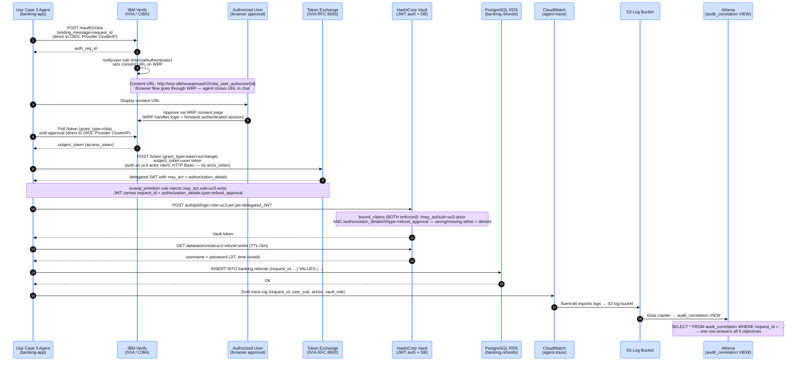

## What Use Case 3 Adds

Use Case 3 extends the workshop stack with four interlocking controls that work together to authorize, enforce, and audit a privileged refund write:

| Capability | Standard (RFC / Spec) | Enforcement Point |
|---|---|---|
| Out-of-band user approval | CIBA (OpenID Connect CIBA) | IBM Verify (IVIA) |
| Delegation proof on the token | Token Exchange `may_act` (RFC 8693) | Vault `bound_claims` |
| Rich Authorization Request | `authorization_details` type (RFC 9396 RAR) | Vault `bound_claims` |
| Time-boxed write credential | 5-minute TTL, SELECT+INSERT+UPDATE only | Vault DB role `uc3-refund-writer` |

A single `request_id` (W3C `traceparent`) propagates through every plane and becomes the JOIN key in the three-plane Athena audit correlation query — the workshop's pedagogical money shot.

:::alert{header="What Vault cryptographically enforces vs. what the audit proves" type="info"}
Vault **cryptographically enforces** three things on the exchanged token before it issues any database credential: the **identity** (`sub` = the human who approved via CIBA), the **delegation** (`may_act.sub` = `uc3-actor`, RFC 8693 — *which agent* may act), and the **RAR type** (`authorization_details[0].type` = `refund_approval`, RFC 9396 — *what class* of action). The **amount/currency** the user approved is **consent-bound by three-plane audit correlation on `request_id`**, not by a token claim — IBM Verify (ISVAOP 25.10) does not surface the consent-time RAR to any mapping rule at the token-exchange stage, and Vault `bound_claims` are string/glob matches that cannot range-check a number anyway. The green, fully-populated `audit_correlation` row is the proof that the amount the user approved is the same amount that hit Vault and the database. This is the correct control, not a consolation prize — see `infrastructure/modules/verify_access/README.md`, "UC3 RAR enforcement model."
:::

## Request Flow

The diagram below shows how `request_id` moves from the agent through CIBA approval, token exchange, Vault JWT auth, the database write, and all three audit planes.

