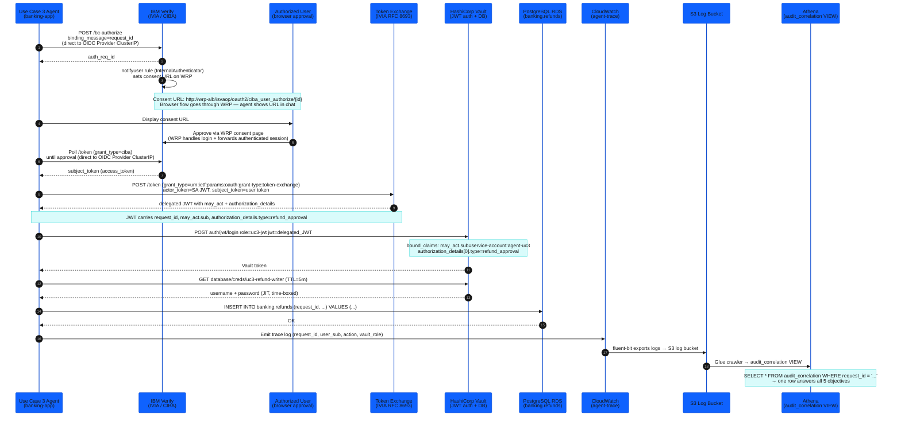

## What Use Case 3 Adds

Use Case 3 extends the workshop stack with four interlocking controls that work together to authorize, enforce, and audit a privileged refund write:

| Capability | Standard (RFC / Spec) | Enforcement Point |
|---|---|---|
| Out-of-band user approval | CIBA (OpenID Connect CIBA) | IBM Verify (IVIA) |
| Delegation proof on the token | Token Exchange `may_act` (RFC 8693) | Vault `bound_claims` |
| Rich Authorization Request | `authorization_details` type (RFC 9396 RAR) | Vault `bound_claims` |
| Time-boxed write credential | 5-minute TTL, SELECT+INSERT+UPDATE only | Vault DB role `uc3-refund-writer` |

A single `request_id` (W3C `traceparent`) propagates through every plane and becomes the JOIN key in the three-plane Athena audit correlation query — the workshop's pedagogical money shot.

## Request Flow

The diagram below shows how `request_id` moves from the agent through CIBA approval, token exchange, Vault JWT auth, the database write, and all three audit planes.

## Sub-modules

1. **[CIBA Out-of-Band Approval](71-ciba-approval-flow/)** — How IVIA handles the backchannel approval and token exchange
2. **[Vault Bound Claims Enforcement](72-configure-bound-claims/)** — How `bound_claims` enforces `may_act` and `authorization_details`
3. **[The Bypass Test](73-bypass-test/)** — Forged JWT rejection proof (run `verify-uc3.sh --bypass`)
4. **[Three-Plane Audit Correlation](74-three-plane-audit/)** — The Athena query that joins all three audit planes by `request_id`
